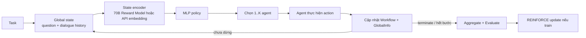
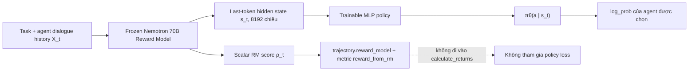
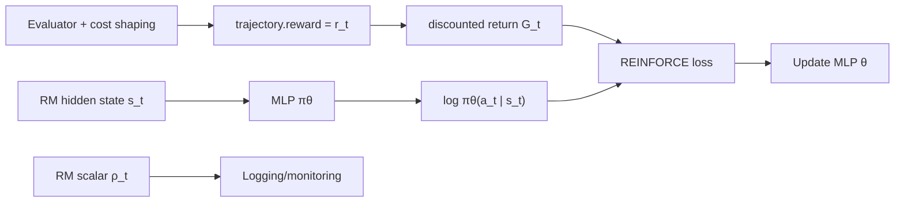
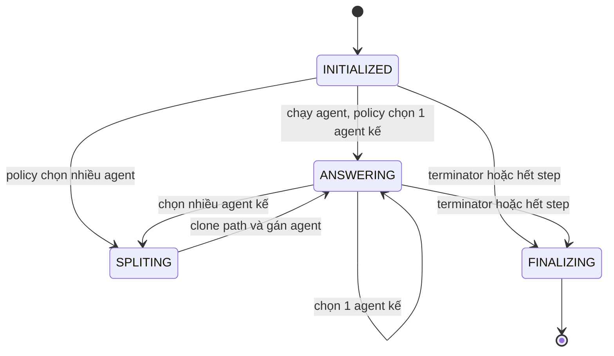
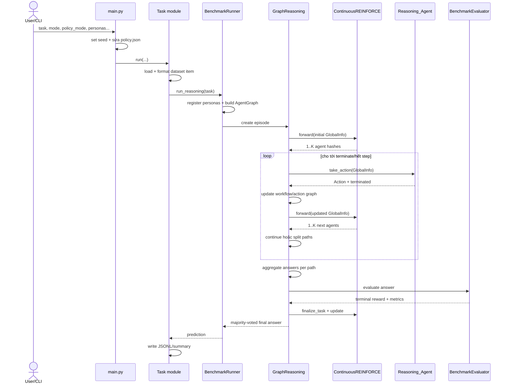
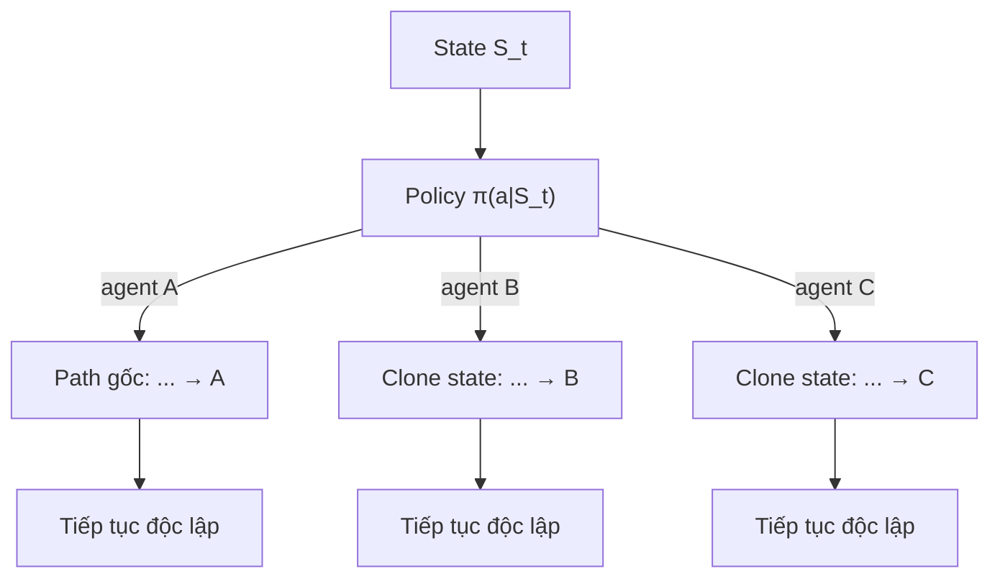

# Hướng dẫn kiến trúc và luồng hoạt động của Puppeteer MAS

> Tài liệu này mô tả **implementation đang có trong repository**, không chỉ mô tả ý tưởng trong paper. Những điểm khác nhau giữa paper, README và code thực tế được đánh dấu rõ để tránh nhầm lẫn.

## Mục lục

1. [Tổng quan nhanh](#1-tổng-quan-nhanh)
2. [Bản đồ codebase](#2-bản-đồ-codebase)
3. [Các khái niệm và cấu trúc dữ liệu chính](#3-các-khái-niệm-và-cấu-trúc-dữ-liệu-chính)
4. [Reward Model 70B trong code gốc của tác giả](#4-reward-model-70b-trong-code-gốc-của-tác-giả)
5. [Orchestrator gồm những thành phần gì](#5-orchestrator-gồm-những-thành-phần-gì)
6. [Flow đầy đủ của MAS](#6-flow-đầy-đủ-của-mas)
7. [Policy, reward shaping và REINFORCE](#7-policy-reward-shaping-và-reinforce)
8. [Agent, model và tool hoạt động ra sao](#8-agent-model-và-tool-hoạt-động-ra-sao)
9. [Đánh giá, tổng hợp đáp án và output](#9-đánh-giá-tổng-hợp-đáp-án-và-output)
10. [Cấu hình và cách chạy](#10-cấu-hình-và-cách-chạy)
11. [Khác biệt giữa paper và code hiện tại](#11-khác-biệt-giữa-paper-và-code-hiện-tại)
12. [Các điểm cần lưu ý khi phát triển tiếp](#12-các-điểm-cần-lưu-ý-khi-phát-triển-tiếp)
13. [Phụ lục: tra cứu file theo trách nhiệm](#13-phụ-lục-tra-cứu-file-theo-trách-nhiệm)

---

## 1. Tổng quan nhanh

Repository này triển khai **Puppeteer**, một Multi-Agent System (MAS) có orchestrator tập trung và có thể học được. Thay vì cố định workflow kiểu chuỗi hoặc DAG từ trước, hệ thống xây dựng workflow trong lúc chạy:

1. Nhận một task benchmark.
2. Mã hóa task cùng lịch sử xử lý hiện tại thành vector trạng thái.
3. Policy network sinh phân phối xác suất trên toàn bộ agent.
4. Chọn một hoặc nhiều agent tiếp theo.
5. Mỗi agent thực hiện đúng một loại hành động: suy luận, phản biện, lập kế hoạch, gọi tool, kết luận hoặc terminate.
6. Nếu chọn nhiều agent, reasoning path được tách nhánh.
7. Khi mọi path kết thúc hoặc chạm giới hạn bước, hệ thống tổng hợp đáp án, chấm điểm và—trong chế độ train—cập nhật policy bằng REINFORCE.

Trong code, từ **Puppeteer/orchestrator** chủ yếu chỉ tổ hợp sau:

- state encoder: Reward Model 70B hoặc embedding API;
- MLP policy network;
- logic chọn agent và tách path;
- trajectory/reward buffer;
- thuật toán cập nhật REINFORCE.

Các agent là **puppets**: chúng sinh nội dung và dùng tool, nhưng không tự quyết định agent kế tiếp. Quyền routing nằm ở policy trung tâm.



### Ba lớp model cần phân biệt

| Lớp | Vai trò | Ví dụ trong cấu hình hiện tại |
|---|---|---|
| Model của agent | Sinh reasoning, answer hoặc tham số tool | Gemini, Gemma, Qwen, Mistral… trong `personas/*.jsonl` |
| State representation model | Biến trạng thái MAS thành vector cho policy | mặc định hiện tại: `models/gemini-embedding-2`; tùy chọn: Nemotron Reward 70B |
| Policy network | Từ vector trạng thái sinh xác suất chọn agent | MLP `d → 512 → 128 → 32 → số agent` |

Reward Model 70B **không phải** LLM trực tiếp giải task và cũng **không phải** toàn bộ orchestrator. Nó là backbone mã hóa trạng thái cho MLP policy; scalar reward nó trả về hiện chỉ được ghi log, không được đưa trực tiếp vào return dùng để backpropagate.

---

## 2. Bản đồ codebase

### 2.1 Cấu trúc cấp cao

```text
ChatDev/
├── README.md                     # Giới thiệu và quick start gốc
├── CODEBASE_GUIDE_VI.md          # Tài liệu này
├── requirements.txt              # Dependency Python
├── assets/framework.png          # Hình kiến trúc dùng trong README
├── puppeteer/
│   ├── main.py                   # CLI entry point
│   ├── config/                   # Cấu hình global và policy
│   ├── tasks/                    # Load/chạy/chấm benchmark
│   ├── agent/                    # Agent runtime, registry, state/workflow
│   ├── inference/                # Orchestrator, graph, path, policy RL
│   ├── model/                    # Model registry, API client, embedding/RM
│   ├── tools/                    # Web, Python interpreter, file reader
│   ├── prompts/                  # Prompt cho reasoning/action/aggregation
│   ├── personas/                 # Định nghĩa agent pool
│   ├── scripts/                  # Tiện ích gộp và phân tích kết quả
│   ├── checkpoint/               # Policy checkpoint `.pt`
│   ├── results/                  # Kết quả benchmark
│   ├── logs/                     # Log, workflow, hình graph theo run
│   └── cache/embeddings/         # Cache vector embedding API
└── puppeteer_env/                # Môi trường cục bộ, không thuộc logic ứng dụng
```

### 2.2 Các package và trách nhiệm

| Package/file | Trách nhiệm |
|---|---|
| [`puppeteer/main.py`](puppeteer/main.py) | Parse CLI, đặt seed, chọn task, chỉnh `policy.json`, chạy benchmark |
| [`puppeteer/tasks/runner.py`](puppeteer/tasks/runner.py) | Tạo agent graph + `GraphReasoning`, chạy một data item |
| [`puppeteer/inference/reasoning/reasoning.py`](puppeteer/inference/reasoning/reasoning.py) | Điều phối cấp episode, quản lý các path, aggregate, evaluate, gọi policy update |
| [`puppeteer/inference/reasoning/path.py`](puppeteer/inference/reasoning/path.py) | State machine của một reasoning path, thực thi agent và split branch |
| [`puppeteer/inference/policy/REINFORCE_continuous.py`](puppeteer/inference/policy/REINFORCE_continuous.py) | MLP policy, chọn agent, trajectory, reward shaping, REINFORCE, checkpoint |
| [`puppeteer/model/embedding.py`](puppeteer/model/embedding.py) | API embedding và local Reward Model 70B |
| [`puppeteer/agent/reasoning_agent.py`](puppeteer/agent/reasoning_agent.py) | Cách một agent fixed-action được activate, query LLM, chạy tool và sinh `Action` |
| [`puppeteer/agent/agent_info/global_info.py`](puppeteer/agent/agent_info/global_info.py) | State riêng của mỗi path: task, workflow, answers, file/url, token/cost |
| [`puppeteer/agent/agent_info/workflow.py`](puppeteer/agent/agent_info/workflow.py) | Lưu action tuần tự, state rút gọn, token/cost, xuất JSON/PNG |
| [`puppeteer/inference/graph/agent_graph.py`](puppeteer/inference/graph/agent_graph.py) | Candidate agent nodes và các cạnh tương tác đã xuất hiện |
| [`puppeteer/inference/graph/action_graph.py`](puppeteer/inference/graph/action_graph.py) | Graph các action thực sự chạy và dependency giữa action |
| [`puppeteer/model/query_manager.py`](puppeteer/model/query_manager.py) | Route mỗi model key tới OpenAI-compatible client phù hợp |
| [`puppeteer/tools/`](puppeteer/tools) | Registry và implementation của external tool |
| [`puppeteer/tasks/evaluator.py`](puppeteer/tasks/evaluator.py) | Reward/metric cuối episode cho từng benchmark |

---

## 3. Các khái niệm và cấu trúc dữ liệu chính

### 3.1 Agent

Theo paper, một agent có thể biểu diễn bằng:

$$
a=(m,r,t)
$$

trong đó:

- $m$: foundation model;
- $r$: reasoning pattern/role prompt;
- $t$: tool được phép dùng.

Trong code, một dòng persona ánh xạ gần như trực tiếp vào bộ ba này:

```json
{
  "name": "PlannerAgent_gemini",
  "agent_type": "reasoning",
  "model_type": "gemini-3.1-flash-lite",
  "actions": ["planning"],
  "role_prompt": "..."
}
```

Implementation hiện tại dùng agent **fixed-action**: `Reasoning_Agent.take_action()` lấy `self.actions[0]`, nên mỗi persona thực tế đại diện cho một hành vi nguyên tử.

### 3.2 GlobalInfo

Mỗi reasoning path có một [`GlobalInfo`](puppeteer/agent/agent_info/global_info.py) riêng. Khi split, object này được `deepcopy`, vì vậy các nhánh có lịch sử độc lập sau thời điểm tách.

Nó giữ:

- `task`: `Question`, `Answer`, `type`, metadata;
- `workflow`: danh sách action đã chạy trên path;
- `answers`: các candidate answer;
- `path_id`, `workpath`, logger;
- URL/file name được trích từ task;
- `code_path` cho task code/text;
- tổng token và cost lấy từ workflow.

### 3.3 Action và Workflow

Mỗi bước sinh một `Action` gồm:

```text
agent_role, agent_model
action = {action, parameter}
result = {step_data, answer}
success
tokens, cost
```

Cost action trong code là:

$$
\operatorname{ActionCost}=2\cdot \operatorname{model\_size}\cdot \operatorname{tokens}
$$

`model_size` lấy từ `model_config.py`. Với API model đây chỉ là estimate, nên đại lượng trên là proxy tính toán chứ không phải tiền API hay FLOPs đo thực tế.

`Workflow.state` rút gọn mỗi bước thành tuple:

$$
(\text{agent role},\text{action name},\mathbb{1}[\text{success}])
$$

Tuy nhiên, vector đưa vào policy không mã hóa tuple này trực tiếp. Policy lấy **dialog history** của các role đã xuất hiện.

### 3.4 Hai graph khác nhau

| Graph | Node | Edge | Mục đích |
|---|---|---|---|
| `AgentGraph` | toàn bộ agent trong persona pool | cặp agent liên tiếp đã xuất hiện trên một path | action space cho policy và visualization topology |
| `ActionGraph` | từng action runtime có UUID | dependency giữa action trước/sau, kể cả lúc split | mô tả execution graph cụ thể |

`AgentGraph` ban đầu có node nhưng chưa có edge. Edge được bổ sung sau mỗi vòng `GraphReasoning.step()` từ `agent_sequence`; agent có thể xuất hiện lặp lại, do đó topology tổng hợp có thể chứa cycle.

---

## 4. Reward Model 70B trong code gốc của tác giả

### 4.1 Phạm vi và nguồn đối chiếu

Mục này chỉ mô tả thiết kế được công bố bởi tác giả và implementation upstream tại nhánh `puppeteer` của `OpenBMB/ChatDev`. Nó không dựa trên các thay đổi của fork cục bộ.

Các file upstream được dùng để lần theo flow:

| File gốc | Phần hành vi được xác nhận |
|---|---|
| [`README.md`](https://github.com/OpenBMB/ChatDev/blob/puppeteer/README.md) | checkpoint được yêu cầu, sơ đồ training và mô tả last-token hidden state |
| [`model/embedding.py`](https://github.com/OpenBMB/ChatDev/blob/puppeteer/puppeteer/model/embedding.py) | load 70B, dựng input, gọi `generate()`, trích hidden state và scalar score |
| [`inference/policy/REINFORCE_continuous.py`](https://github.com/OpenBMB/ChatDev/blob/puppeteer/puppeteer/inference/policy/REINFORCE_continuous.py) | MLP, action sampling, trajectory, discounted return và policy loss |
| [`inference/graph/agent_graph.py`](https://github.com/OpenBMB/ChatDev/blob/puppeteer/puppeteer/inference/graph/agent_graph.py) | ghép task và dialog history thành context cho Reward Model |
| [`agent/agent.py`](https://github.com/OpenBMB/ChatDev/blob/puppeteer/puppeteer/agent/agent.py) | tạo `simplified_dialog_history` dùng trong context |
| [`agent/agent_info/workflow.py`](https://github.com/OpenBMB/ChatDev/blob/puppeteer/puppeteer/agent/agent_info/workflow.py) | tính proxy cost của action/token/model |
| [`inference/reasoning/reasoning.py`](https://github.com/OpenBMB/ChatDev/blob/puppeteer/puppeteer/inference/reasoning/reasoning.py) | evaluator reward cuối episode và lệnh update policy |
| [`config/global.yaml`](https://github.com/OpenBMB/ChatDev/blob/puppeteer/puppeteer/config/global.yaml) | `model_weight_path` của checkpoint |
| [`config/policy.json`](https://github.com/OpenBMB/ChatDev/blob/puppeteer/puppeteer/config/policy.json) | CUDA, learning rate, gamma, KL và reward factors |

Nguồn mô tả thuật toán/model là [paper Puppeteer](https://arxiv.org/abs/2505.19591), [NVIDIA model card](https://huggingface.co/nvidia/Llama-3.1-Nemotron-70B-Reward-HF) và [paper HelpSteer2-Preference](https://arxiv.org/abs/2410.01257).

README upstream gọi model này là **“untrained Puppeteer base”**: “untrained” ở đây nói về policy orchestrator chưa được evolve, không có nghĩa checkpoint Reward Model là model chưa train. Checkpoint NVIDIA đã được train để dự đoán chất lượng response; Puppeteer đóng băng backbone đó và học MLP routing đặt phía trên hidden state của nó.

### 4.2 Bản thân NVIDIA Reward Model 70B là gì

Model được dùng là **Llama-3.1-Nemotron-70B-Reward**, với bản chuyển đổi dùng được trực tiếp trong Hugging Face Transformers là `nvidia/Llama-3.1-Nemotron-70B-Reward-HF`.

Nó được xây dựng từ Llama 3.1 70B Instruct để nhận một hội thoại gồm prompt và response, sau đó chấm chất lượng lượt trả lời assistant cuối cùng. Model card nêu rõ:

- reward cao hơn biểu thị response được ưu tiên hơn khi so sánh trên **cùng prompt**;
- không nên so sánh reward tuyệt đối giữa các prompt khác nhau;
- input phục vụ chấm reward được giới hạn ở tối đa 4096 token theo recipe công bố;
- bản HF có hidden size 8192, 80 transformer layers, 64 attention heads và 8 key-value heads.

Về mặt khái niệm, nếu $x$ là prompt và $y$ là response, Reward Model học hàm:

$$
r_\phi(x,y)\in\mathbb{R}
$$

trong đó $r_\phi$ là điểm ưu tiên, không phải xác suất và không phải thang điểm chất lượng tuyệt đối dùng chung cho mọi task.

### 4.3 Reward Model NVIDIA được huấn luyện như thế nào

Theo HelpSteer2-Preference, model cuối kết hợp hai nguồn supervision rồi thực hiện weight extrapolation.

#### Giai đoạn 1 — Helpfulness-only SteerLM Regression

Hidden representation của token kết thúc response được chiếu qua linear head để dự đoán helpfulness score. Với ground-truth rating $q$, loss hồi quy có dạng:

$$
\mathcal{L}_{reg}
=\frac{1}{N}\sum_{i=1}^{N}
\left(r_\phi(x_i,y_i)-q_i\right)^2
$$

Giai đoạn này tạo **weak/regression model**, giúp reward có initialization hợp lý trước khi học preference pair.

#### Giai đoạn 2 — Scaled Bradley–Terry

Với cùng prompt $x$, gọi $y_c$ là response được chọn, $y_r$ là response bị loại và $m\in\{1,2,3\}$ là độ mạnh của preference. Xác suất Bradley–Terry cơ bản là:

$$
P(y_c\succ y_r\mid x)
=\sigma\left(r_\phi(x,y_c)-r_\phi(x,y_r)\right)
$$

Trong đó:

$$
\sigma(z)=\frac{1}{1+e^{-z}}
$$

Scaled Bradley–Terry loss được paper định nghĩa:

$$
\mathcal{L}_{SBT}
=-m\log\sigma\left(
r_\phi(x,y_c)-r_\phi(x,y_r)
\right)
$$

Preference càng mạnh thì sample càng có trọng số lớn. Scaled BT model được khởi tạo từ helpfulness-only regression model.

#### Giai đoạn 3 — ExPO weight extrapolation

Paper tiếp tục dùng weak-to-strong extrapolation. Gọi $\phi_w$ là trọng số regression model và $\phi_s$ là trọng số Scaled BT model, phép extrapolation có thể biểu diễn:

$$
\phi_{final}
=\phi_w+\alpha(\phi_s-\phi_w)
$$

Tác giả tìm được $\alpha=1.52$. Model cuối thường được mô tả là **Scaled BT + ExPO**, đạt 94.1 RewardBench trong báo cáo công bố.

Đây là quá trình huấn luyện **checkpoint NVIDIA Reward Model** trước khi nó được đưa vào Puppeteer. Nó khác với quá trình Puppeteer dùng REINFORCE để học cách chọn agent.

### 4.4 Reward Model được load trong Puppeteer gốc

Trong upstream, `ContinuousREINFORCE` import trực tiếp `RewardModelTokenRepresentation` và luôn khởi tạo:

```python
self.state_representation = RewardModelTokenRepresentation()
self.policy_network = MLP_PolicyNetwork(
    self.state_representation.dim,
    self.actions_dim,
)
```

File `embedding.py` gốc cũng định nghĩa helper `OpenAIEmbedding`, nhưng `ContinuousREINFORCE` không import hoặc gọi helper đó. Đường state-representation của policy upstream không có nhánh lựa chọn encoder: nó luôn khởi tạo `RewardModelTokenRepresentation`.

`RewardModelTokenRepresentation.__init__()` thực hiện:

```python
self.model_name = "nvidia/Llama-3.1-Nemotron-70B-Reward-HF"
self.model = AutoModelForCausalLM.from_pretrained(
    MODEL_WEIGHT_PATH,
    torch_dtype=torch.bfloat16,
    device_map="auto",
)
self.tokenizer = AutoTokenizer.from_pretrained(MODEL_WEIGHT_PATH)
```

`MODEL_WEIGHT_PATH` lấy từ `config/global.yaml`. README upstream ghi model ID bản NeMo không có hậu tố `-HF`, nhưng class và API Transformers tương ứng với bản `-HF`; khi dùng `AutoModelForCausalLM`, bản HF là lựa chọn khớp trực tiếp với code.

Policy config gốc đặt device là CUDA. Input tensors cũng được chuyển cứng sang `'cuda'`. Toàn bộ forward của Reward Model nằm trong `torch.no_grad()`, nên tham số 70B không nhận gradient từ Puppeteer.

### 4.5 Context đưa vào Reward Model trong code gốc

Ở mỗi quyết định routing, `get_state_representation()` lấy:

```python
role_list = global_info.agent_role_list()
state_context = self.agent_graph.get_agent_dialog_history(
    role_list,
    question=global_info.task.get("Question"),
)
state, reward = self.state_representation(state_context)
```

`role_list` là thứ tự các agent đã thực hiện action trên path. `AgentGraph.get_agent_dialog_history()` nối `simplified_dialog_history` của các role đó.

Nếu chưa có action, context là một system message duy nhất:

```text
You are an assistant. Your task is to <Question>
```

Nếu đã có action, context chứa system prompt và lịch sử user/assistant của các agent đã chạy. `simplified_dialog_history` loại phần khớp regex `*...*` khỏi user messages để mask một phần previous reasoning.

Gọi toàn bộ context tại bước $t$ là:

$$
X_t=\operatorname{ConcatHistory}
\left(\tau,a_0,o_0,\ldots,a_{t-1},o_{t-1}\right)
$$

trong đó $\tau$ là task, $a_i$ là agent và $o_i$ là output trung gian.

### 4.6 Tiền xử lý và forward đúng theo upstream

Trước tokenize, code cộng độ dài ký tự của tất cả message. Khi tổng vượt 12000, mỗi message chỉ giữ 75% phần cuối, lặp đến khi tổng đủ nhỏ:

$$
X_t^{(j+1)}
=\operatorname{suffix}_{0.75|X_t^{(j)}|}
\left(X_t^{(j)}\right)
$$

Sau đó upstream gọi `apply_chat_template(..., max_length=4096)` nhưng không truyền rõ `truncation=True`. Vì vậy tài liệu chỉ có thể khẳng định chắc chắn rằng code đặt `max_length=4096`; việc truncate token còn phụ thuộc hành vi tokenizer/version Transformers.

Forward inference:

```python
response_token_ids = self.model.generate(
    input_ids=input_ids,
    attention_mask=attention_mask,
    max_new_tokens=1,
    return_dict_in_generate=True,
    output_scores=True,
    output_logits=True,
    output_hidden_states=True,
)
```

Model chỉ generate một token vì reward inference được mã hóa theo recipe của checkpoint HF, không phải vì Puppeteer cần sinh thêm câu trả lời bằng model 70B.

### 4.7 Hai output: hidden state và scalar reward

Upstream trích hai đại lượng:

```python
reward = response_token_ids['scores'][0][0][0].item()
hidden_states = response_token_ids.hidden_states
state = hidden_states[0][-1]
last_state = state[:, -1, :]
return last_state, reward
```

#### Scalar score của Reward Model

$$
\rho_t
=\operatorname{scores}[0][0][0]
$$

Đây là scalar reward score theo đúng cách dùng trong NVIDIA model card.

#### Vector trạng thái cho Puppeteer

Gọi $H_{t}^{(L)}$ là hidden tensor của layer cuối tại generation step đầu. Puppeteer lấy token cuối:

$$
s_t=H_{t,-1}^{(L)}\in\mathbb{R}^{8192}
$$

Shape thực tế với batch size 1 là `(1, 8192)`. Đây mới là đầu vào trực tiếp của policy network.



### 4.8 MLP policy đặt trên Reward Model

Với $A$ agent, MLP upstream có kiến trúc `8192 → 512 → 128 → 32 → A`:

$$
h_1=\operatorname{ReLU}(W_1s_t+b_1)
$$

$$
h_2=\operatorname{ReLU}(W_2h_1+b_2)
$$

$$
h_3=\operatorname{ReLU}(W_3h_2+b_3)
$$

$$
\pi_\theta(a\mid s_t)
=\operatorname{softmax}(W_4h_3+b_4)_a
$$

Reward Model chạy dưới `no_grad`; chỉ các tham số $\theta=\{W_i,b_i\}$ của MLP được optimizer Adam cập nhật.

Vì vậy, cách diễn đạt chính xác là:

> Reward Model 70B cung cấp một biểu diễn trạng thái đã học từ human preference; Puppeteer học một policy head nhỏ trên biểu diễn đó để route agent.

### 4.9 Hai loại “reward” trong code gốc không phải một

Upstream dùng hai trường riêng:

| Đại lượng | Nguồn | Nơi lưu | Đi vào return/loss? |
|---|---|---|---:|
| $\rho_t$ — Reward Model score | `RewardModelTokenRepresentation` | `reward_model`, `reward_from_rm` | Không |
| $r_t$ — policy/environment reward | cost shaping + benchmark evaluator | `trajectory['reward']` | Có |

Khi policy forward, code thực hiện:

```python
state, rew = self.get_state_representation(global_info)
action_probs = self.policy_network(state)
self.reward_from_rm.append(rew)
```

Khi append trajectory:

```python
{
    "reward": cost,
    "reward_model": rew,
    ...
}
```

`calculate_returns()` của upstream chỉ đọc key `reward`:

```python
R = 0
for t in reversed(trajectory):
    R = t.get('reward', 0) + self.gamma * R
```

Do đó:

$$
G_t=r_t+\gamma G_{t+1}
$$

không phải:

$$
G_t=(r_t+\rho_t)+\gamma G_{t+1}
$$

Scalar $\rho_t$ chỉ xuất hiện lại trong metric:

```python
'reasoning/reward_from_rm': sum(self.reward_from_rm)
```

### 4.10 Reward thực sự cập nhật policy gốc đến từ đâu

Ở bước thường, upstream tạo reward từ logarithmic cost nhân agent-specific factor:

$$
r_t^{step}=C_t\,f(a_t)
$$

Ở cuối episode, `GraphReasoning.finalize()` tạo task reward từ evaluator:

- MMLU-Pro/GSM-Hard: $+1$ nếu đúng, $-1$ nếu sai;
- SRDD/CW: metric chất lượng do evaluator trả về.

`finalize_task()` kết hợp task reward với terminate shaping và token/model cost. Sau đó REINFORCE loss dùng discounted return:

$$
\mathcal{L}_{policy}
=-\sum_t\log\pi_\theta(a_t\mid s_t)G_t
$$

cộng optional KL term và trừ entropy bonus như mô tả ở mục 7.

Luồng gradient là:



### 4.11 Kết luận chính xác về Reward Model trong code gốc

Trong Puppeteer upstream:

1. Nemotron 70B là state-representation backbone bắt buộc.
2. Model được đóng băng; Puppeteer không fine-tune 70B weights.
3. Hidden state token cuối 8192 chiều trực tiếp điều kiện hóa xác suất chọn agent.
4. Scalar reward score được tính, lưu theo trajectory và ghi metric.
5. Scalar score đó **không được cộng vào discounted return và không trực tiếp cập nhật policy** trong code công khai.
6. Policy MLP được cập nhật bởi reward từ benchmark evaluator kết hợp cost/termination shaping.

Điều này cũng khớp với README upstream: phần “Training Paradigm” chỉ khẳng định hidden state token cuối của Reward Model được truyền qua MLP để sinh action probabilities; README không nói scalar Reward Model score được dùng làm REINFORCE return của orchestrator.

---

## 5. Orchestrator gồm những thành phần gì

Orchestrator không nằm trong một class duy nhất. Nó được ghép từ các thành phần sau.

### 5.1 Agent pool và registry

[`AgentRegister`](puppeteer/agent/register/register.py) đọc persona JSONL, tạo `Reasoning_Agent` và index chúng bằng:

- role name;
- MD5 hash sinh lúc khởi tạo;
- numerical `index`.

Policy action space có kích thước:

$$
|\mathcal{A}|=\texttt{agent\_graph.num}
$$

Persona mặc định `personas.jsonl` có 14 agent: file, arXiv, Bing, website, Python, planning, reasoning, critique, reflect, question, summarize, conclude, modify và terminate.

### 5.2 AgentGraph

`AgentGraph` chứa toàn bộ candidate agent và cung cấp:

- `hash_nodes`: mapping output index của policy sang agent hash;
- `role_nodes`: tên action/agent trong trajectory;
- vị trí terminator;
- vị trí các web-search agent để áp reward factor khác;
- dialog history làm state input;
- topology agent-to-agent đã quan sát.

### 5.3 State representation

Một trong hai implementation:

- `RewardModelTokenRepresentation`: local Nemotron 70B, state dimension 8192;
- `APIEmbeddingStateRepresentation`: embedding API, dimension theo config.

### 5.4 MLP policy

`MLP_PolicyNetwork` ánh xạ state sang distribution trên agent. Đây là phần tham số được train và lưu trong checkpoint.

### 5.5 Optional LLM prior

[`LLMPolicy`](puppeteer/inference/policy/base_policy.py) có thể dùng một LLM chọn agent trước, biến lựa chọn thành distribution nhiệt độ 0.1, sau đó trộn với MLP:

$$
\tilde{\pi}=(1-w)\pi_\theta+w\pi_{LLM}
$$

rồi normalize lại. Chức năng này chỉ chạy khi:

```json
"prior": true,
"prior_redistribution": true
```

Mặc định cả hai là `false`.

### 5.6 Agent selector

Code không sample đúng một agent mỗi bước. Nó đặt ngưỡng động:

$$
\eta=\frac{2}{|\mathcal{A}|}
$$

và chọn mọi agent có:

$$
\pi_\theta(a\mid s_t)>\eta
$$

Sau đó sort giảm dần và cắt còn:

$$
K\le\min(\texttt{max\_path},\texttt{max\_num\_agents})
$$

Nếu không agent nào vượt ngưỡng, code sample không hoàn lại từ distribution với số lượng `min(max_path, max_num_agents)`.

Với config hiện tại và persona mặc định:

- $|\mathcal{A}|=14$;
- $\eta=2/14\approx0.1429$;
- chọn tối đa 3 agent vì `max_num_agents=3`.

Trường `agent.threshold=0.5` trong JSON không được `select_agents_by_threshold()` sử dụng; hàm ghi đè threshold bằng $2/|\mathcal{A}|$.

### 5.7 Path state machine

Mỗi `GraphReasoningPath` có trạng thái:



Enum còn có `DISCARDING` và `AGGREGATING`, nhưng flow hiện tại không chuyển vào hai trạng thái này.

### 5.8 GraphReasoning episode controller

`GraphReasoning`:

- khởi tạo path đầu tiên từ policy;
- chạy từng path tối đa `max_parallel_paths`;
- xử lý split;
- cập nhật `AgentGraph`;
- dừng khi các path active đều finalizing/discarding;
- aggregate đáp án từng path;
- tạo terminal reward;
- gọi `policy.finalize_task()` và `policy.update()`;
- majority vote giữa các path.

### 5.9 Reward/evaluator và optimizer

Evaluator tạo task-quality signal; policy bổ sung efficiency shaping; optimizer Adam cập nhật MLP. Đây là nhánh “adaptive evolution” của orchestrator.

### 5.10 Checkpoint, log và visualization

Orchestrator còn có hạ tầng quan sát:

- policy checkpoint: `checkpoint/<task>_<mode>_<policy_mode>/policy_net_*.pt`;
- `meta.log`, `model_query.log`, `train.log`, `pathN.log`;
- `path_N.jsonl`;
- `workflow_path_N.png`;
- `agent_graph.html`, `action_graph.html`.

---

## 6. Flow đầy đủ của MAS

### 6.1 Flow cấp chương trình



### 6.2 Bước 1 — CLI và policy mode

`main.py` nhận:

```text
python main.py <task> <mode>
  [--data_limit N]
  [--data_start N]
  [--personas PATH]
  [--policy_mode initialized|evolved|train]
  [--checkpoint PATH]
  [--seed N]
```

Các task hợp lệ: `MMLU-Pro`, `gsm-hard`, `SRDD`, `CW`.

| Policy mode | Train? | Load checkpoint? | Ý nghĩa |
|---|---:|---:|---|
| `initialized` | không | không | MLP random/fresh |
| `evolved` | không | có | inference bằng policy đã học; nếu không tìm thấy checkpoint thì cảnh báo và chạy initialized |
| `train` | có | chỉ khi có `--checkpoint` | online policy update, có thể resume |

`main.py` ghi các lựa chọn này trở lại `config/policy.json`. Đây là mutation bền trên filesystem, không chỉ config in-memory.

### 6.3 Bước 2 — Load và chuẩn hóa task

Mỗi task module biến row dataset về schema chung:

```python
{
    "type": "...",
    "Question": "...",
    "Answer": "...",   # không có ở một số open-ended task
    "id": ...
}
```

- MMLU-Pro: đọc Parquet, ghép category + options A/B/C…
- GSM-Hard: đọc Parquet, shuffle deterministic theo seed, hỗ trợ batch offset.
- SRDD: đọc CSV mô tả phần mềm.
- CW: đọc creative-writing JSONL và concepts.

### 6.4 Bước 3 — Tạo agent pool và graph

`BenchmarkRunner.setup_reasoning()`:

1. `register_all_agents(personas_path)`;
2. reset agent state;
3. tạo `AgentGraph` từ registry;
4. tạo `GraphReasoning`;
5. `GraphReasoning` tạo `ActionGraph`, `LogManager` và `ContinuousREINFORCE`.

Policy kiểm tra bắt buộc phải có agent tên bắt đầu bằng `TerminatorAgent`.

### 6.5 Bước 4 — Chọn agent mở đầu

`GraphReasoning.start()` tạo `GlobalInfo(path_id=-1)`. Vì workflow rỗng, state encoder nhìn thấy câu hỏi ban đầu. Policy sinh distribution và có thể chọn nhiều agent.

Mỗi selected agent tạo một path riêng với `path_id=0..K-1`. Agent được `activate()`, qua đó system prompt được dựng từ:

- role prompt;
- task question;
- tool results thành công đã có.

### 6.6 Bước 5 — Agent thực hiện action

`GraphReasoningPath.step()` gọi:

```python
current_agent.take_action(global_info, external_tools_enabled, env, env_name)
```

Hai trường hợp:

1. **Terminator agent**: tạo action `terminate`, không query LLM, trả `terminated=True`.
2. **Agent khác**: action đã cố định bởi persona:
   - tool action: LLM sinh parameter JSON, registry chạy tool, sau đó agent có thể format answer;
   - reasoning action: prompt tương ứng được nạp, LLM sinh reasoning, regex trích `FINAL ANSWER` nếu có.

Kết quả được bọc trong `Action`; token và proxy cost được ghi vào workflow.

### 6.7 Bước 6 — Cập nhật state runtime

Sau action:

- `GlobalInfo.update()` thêm action vào workflow;
- workflow được ghi xuống `path_<id>.jsonl`;
- action được thêm vào `ActionGraph`;
- `frontier` nối dependency từ action trước đến action mới;
- candidate answer được giữ trong `GlobalInfo.answers`.

Nếu agent terminate hoặc số agent trong `agent_sequence` đạt `max_step_num`, path chuyển `FINALIZING`.

### 6.8 Bước 7 — Chọn agent tiếp theo và split

Nếu chưa dừng, policy mã hóa state mới và chọn next agents:

- 1 agent: activate và tiếp tục trên cùng path;
- nhiều agent: path chuyển `SPLITING`.

Khi split:

- agent đầu tiên tiếp tục trên path gốc;
- các agent còn lại nhận bản sao `agent_sequence`, `GlobalInfo`, environment và frontier;
- tổng số path bị chặn bởi `max_parallel_paths`;
- policy trajectory tương ứng cũng được clone đến trước action gây nhánh, sau đó append action riêng cho từng nhánh.



### 6.9 Bước 8 — Kết thúc path và aggregate

`n_step(max_step_num)` chạy nhiều vòng và dừng sớm nếu mọi path đã finalizing/discarding.

Với từng path:

- nếu có `last_query_func`, một agent LLM aggregate candidate answers theo prompt cho từng task;
- với SRDD/CW, trả path file chứa artifact;
- nếu không có query function, dùng candidate cuối.

Sau khi có answer cho từng path, evaluator tạo terminal reward.

### 6.10 Bước 9 — Final reward, learning và đáp án cuối

Với mỗi path:

1. tạo transition terminal;
2. `finalize_task()` scale step reward theo token/model cost và thêm terminator reward;
3. đánh dấu trajectory finalized;
4. sau tất cả path, `policy.update()` chạy REINFORCE nếu đang train;
5. reset agent;
6. nếu nhiều closed-domain answer, dùng majority vote.

Cuối cùng task module ghi prediction và metric ra `results/`.

---

## 7. Policy, reward shaping và REINFORCE

### 7.1 Trajectory lưu những gì

Mỗi policy decision thêm một record:

```python
{
    "prob": pi(a_t | s_t),
    "log_prob": log pi(a_t | s_t),
    "state_identifier": workflow.state,
    "action": agent_role,
    "reward": shaped_step_reward,
    "reward_model": rm_score,
    "prior_prob": llm_prior_prob_or_none,
}
```

Khi finalize, record cuối còn có `finalized`, `total_tokens`, `total_cost`, và task metrics.

### 7.2 Step cost logarithmic

Gọi:

- $c$: `cost.scale`;
- $g$: `cost.growth_rate`;
- $M$: `graph.max_step_num`;
- $k$: chiều dài trajectory hiện tại.

Code chuẩn hóa:

$$
u_k=\frac{k+1}{M+1}
$$

Nếu `inverse=false`:

$$
\kappa_k=c\cdot\frac{\log(1+g u_k)}{\log(1+g)}
$$

Nếu `inverse=true`:

$$
\kappa_k=c\left(1-\frac{\log(1+g u_k)}{\log(1+g)}\right)
$$

Với config hiện tại: $c=0.1$, $g=1$, $M=5$.

### 7.3 Agent-specific reward factor

Mỗi action ban đầu nhận:

$$
r_k^{step}=\kappa_k f(a_k)
$$

với:

$$
f(a)=
\begin{cases}
+0.5 & a=\text{Terminator}\
-1.5 & a\in\{\text{Website, Bing, Arxiv}\}\
-1.0 & \text{agent khác}
\end{cases}
$$

Do đó reasoning/tool thông thường chịu penalty âm tăng theo bước; web search bị phạt mạnh hơn; terminator có factor dương.

### 7.4 Scale theo token/model proxy cost

Khi finalize, code nhân mỗi reward đang có với:

$$
\frac{\operatorname{ActionCost}_k}{100000}
=\frac{2\cdot \operatorname{model\_size}_k\cdot\operatorname{tokens}_k}{100000}
$$

tức là:

$$
\hat r_k^{step}=r_k^{step}\cdot
\frac{2\cdot\operatorname{model\_size}_k\cdot\operatorname{tokens}_k}{100000}
$$

Vì $r_k^{step}$ phần lớn âm, agent đắt/nhiều token bị penalty lớn hơn.

### 7.5 Terminal quality reward

Gọi $q$ là reward từ evaluator. Code tạo reward terminator:

$$
r_T=
\begin{cases}
q+0.5\kappa_T,&q>0\\
q-0.5\kappa_T,&q\le0
\end{cases}
$$

Nếu trajectory chưa kết thúc bằng Terminator, code append một action Terminator ảo vào policy trajectory. Nếu action cuối đã là Terminator, record cuối bị ghi đè reward terminal.

Task-quality reward:

- MMLU-Pro: $q=+1$ nếu đúng, $-1$ nếu sai;
- GSM-Hard: $q=+1$ nếu đúng, $-1$ nếu sai;
- SRDD: $q=\text{consistency}\times\text{completeness}$ nếu chạy được, ngược lại $-1$;
- CW: nếu coverage bằng 0 thì $-1$, ngược lại coverage nhân trung bình grammar/relevance/consistency.

### 7.6 Discounted return

Code duyệt ngược trajectory:

$$
G_t=r_t+\gamma G_{t+1},\qquad G_{T+1}=0
$$

với `gamma=0.99` mặc định.

### 7.7 REINFORCE loss thực tế

Cho $N=$ `sample_size`, loss trước entropy là:

$$
\mathcal{L}_{policy}
=\frac{1}{N}\sum_{n=1}^{N}\sum_{t}
\left[-\log\pi_\theta(a_t\mid s_t)G_t
+\lambda_{KL}\ell^{KL}_t\right]
$$

Nếu có LLM prior, code tính cho selected action:

$$
\ell^{KL}_t
=p_{prior}(a_t)\log\frac{p_{prior}(a_t)}{\pi_\theta(a_t\mid s_t)+10^{-10}}
$$

Entropy tại một decision:

$$
\mathcal{H}(\pi_t)=-\sum_a\pi_t(a)\log(\pi_t(a)+10^{-10})
$$

Loss cuối trong code:

$$
\mathcal{L}
=\mathcal{L}_{policy}-\sum_t\mathcal{H}(\pi_t)
$$

sau đó `Adam.zero_grad()`, `backward()`, `step()`.

Config hiện tại đặt `lambda_kl_loss=0.0`, nên nhánh KL không ảnh hưởng update. Code cũng không chuẩn hóa return và không dùng baseline/value function; đây là REINFORCE trực tiếp.

### 7.8 Quan hệ với công thức trong paper

Paper tối ưu:

$$
J(\theta)=\mathbb{E}_{\pi_\theta}[R(\tau)]
$$

với gradient Monte Carlo:

$$
\nabla_\theta J(\theta)\approx
\frac{1}{N}\sum_{n=1}^{N}
\left(\sum_{t=1}^{T}\nabla_\theta\log\pi_\theta(a_t\mid S_t)\right)R(\tau)
$$

Paper mô tả terminal quality trừ chi phí tính toán theo log. Code hiện thực cùng tinh thần nhưng chi tiết khác: reward theo agent factor, scale bằng token/model proxy, bonus/penalty terminate, discounted per-step returns và entropy bonus.

---

## 8. Agent, model và tool hoạt động ra sao

### 8.1 Persona sets

| File | Số agent | Mục tiêu |
|---|---:|---|
| `personas/personas.jsonl` | 14 | pool mặc định, Gemini/Gemma |
| `personas/personas_gsm_local.jsonl` | 7 | pool gọn cho GSM |
| `personas/personas_mimas.jsonl` | 14 | nhóm model nhỏ/open-source |
| `personas/personas_titan.jsonl` | 14 | nhóm model lớn/API |
| `personas/test_personas.jsonl` | 7 | cấu hình test |

Mỗi pool phải thỏa:

- mọi `model_type` tồn tại trong `MODEL_REGISTRY`;
- action thuộc reasoning/tool/termination list;
- có ít nhất một role bắt đầu bằng `TerminatorAgent`.

### 8.2 Action taxonomy

`agent/agent_info/actions.py` định nghĩa:

- reasoning: `reasoning`, `critique`, `question`, `reflect`, `conclude`, `summarize`, `planning`, `modify`;
- tool: `search_arxiv`, `search_bing`, `access_website`, `run_python`, `read_file`;
- termination: `terminate`.

### 8.3 Prompt flow của reasoning agent

`Reasoning_Agent.activate()` dựng system prompt từ `system_prompt.json`.

Với reasoning action:

1. tìm prompt theo action trong `actions_reasoning.jsonl`;
2. chèn previous successful reasoning results;
3. query model;
4. tìm marker `FINAL ANSWER:`;
5. lưu answer nếu có.

Với tool action:

1. tìm prompt parameter trong `actions_external_tools.jsonl`;
2. LLM sinh JSON `{action, parameter}`;
3. `JsonFormat` sửa JSON nếu cần;
4. action name bị ép lại về fixed action của persona;
5. tool registry thực thi;
6. kết quả tool được thêm vào dialog;
7. `answer_prompt.json` hướng dẫn model format candidate answer.

### 8.4 Model registry và API routing

`model/model_config.py` khai báo:

- tên nội bộ;
- tên model gửi cho API;
- provider/profile;
- max token;
- model size proxy;
- temperature.

`APIConfig` đọc `global.yaml`, resolve API key từ biến môi trường và header. `ModelQueryManager` tạo OpenAI client cho từng profile rồi route theo model key.

`chat_completion_request()`:

- retry exponential;
- giới hạn output request thực tế tối đa 4096 token;
- bỏ các parameter không tương thích khi gọi Gemini/Hugging Face router;
- lấy token usage, fallback bằng độ dài ký tự;
- khi lỗi, rút ngắn message dài nhất dần qua các lần retry.

### 8.5 Tool registry

Tool được đăng ký bằng decorator import-time:

- `search_arxiv`: tối đa 5 kết quả arXiv;
- `search_bing`: browser text đơn giản;
- `access_website`: tải và chuyển trang thành text;
- `run_python`: ghi `agent-main.py`, chạy subprocess tối đa 10 giây;
- `read_file`: chuyển nhiều định dạng tài liệu sang text/Markdown.

Tool result luôn theo cặp `(success: bool, data: str)` và được ghi vào workflow.

---

## 9. Đánh giá, tổng hợp đáp án và output

### 9.1 Aggregate trong một path

- Closed-domain: dùng prompt aggregation với LLM nếu có `last_query_func`.
- SRDD/CW: trả file artifact cuối.
- Không có query function: dùng answer cuối.

### 9.2 Majority vote giữa các path

MMLU trước tiên trích letter; GSM trích number; sau đó đếm exact string. Nếu hòa, implementation chọn phần tử cuối trong nhóm đồng hạng.

### 9.3 Evaluator formulas

#### MMLU-Pro

Parser thử nhiều pattern như `answer is X`, `is X`, `(X)` rồi so với ground truth.

#### GSM-Hard

Trích số đầu tiên từ text. Đúng nếu:

$$
|\hat y-y|<10^{-3}
$$

hoặc bằng nhau sau rounding; với số lớn còn thử so phần nguyên.

#### SRDD

Consistency là cosine similarity giữa embedding mô tả và code:

$$
\operatorname{cos}(x,y)=\frac{x\cdot y}{\|x\|\|y\|}
$$

Completeness bằng 0 nếu còn `pass`/`todo`, ngược lại 1. Nếu code chạy được:

$$
q=\operatorname{consistency}\cdot\operatorname{completeness}
$$

nếu không chạy được: $q=-1$.

#### Creative Writing/CommonGen

Coverage:

$$
\operatorname{coverage}=1-\frac{\#\text{concept bị thiếu}}{\#\text{concept}}
$$

LLM judge chấm grammar, relevance, consistency từ 1 đến 4 rồi code chia 4. Nếu coverage dương:

$$
q=\operatorname{coverage}\cdot
\frac{grammar+relevance+consistency}{3}
$$

### 9.4 Output artifacts

Mỗi run sinh:

- kết quả JSONL trong `results/<task>_<mode>_<policy_mode>/`;
- summary riêng cho GSM-Hard;
- log folder timestamp trong `logs/<task>/<timestamp>/`;
- workflow JSON cho từng path;
- hình PNG workflow;
- interactive HTML agent/action graphs;
- checkpoint `.pt` khi training/save.

---

## 10. Cấu hình và cách chạy

### 10.1 `config/global.yaml`

Nhóm chính:

- `logging`: level, log path;
- `state_representation`: encoder type, embedding provider/model/dim/cache;
- `reward_model`: dtype, device map, quantization, max length/chars;
- `api_providers`: endpoint/profile và biến môi trường key;
- retry và JSON reformat;
- external tools;
- root file path;
- graph width/depth.

### 10.2 `config/policy.json`

Nhóm chính:

- device;
- checkpoint path/load flag;
- train flag, learning rate, sample size, gamma, KL;
- max agents/path và reward factors;
- optional LLM prior;
- logarithmic cost;
- dataset/policy mode/seed.

### 10.3 Chạy bằng embedding API

Từ thư mục `puppeteer`:

```bash
python main.py gsm-hard test \
  --policy_mode initialized \
  --data_limit 10 \
  --personas personas/personas_gsm_local.jsonl
```

Cần đặt API key tương ứng với `provider_profile`, ví dụ `GEMINI_API_KEY`.

### 10.4 Cấu hình Reward Model 70B theo upstream gốc

Upstream không có cơ chế chọn giữa nhiều state encoder. `ContinuousREINFORCE` luôn khởi tạo `RewardModelTokenRepresentation`, vì vậy chỉ cần đặt `model_weight_path` trong `config/global.yaml` tới thư mục checkpoint đã tải hoặc Hugging Face repository tương thích:

```yaml
model_weight_path: nvidia/Llama-3.1-Nemotron-70B-Reward-HF
```

Code gốc không có các khóa `state_representation`, `reward_model.quantization`, `reward_model.max_length` hay `reward_model.max_chars`. Các giá trị liên quan được viết trực tiếp trong `embedding.py`: dtype `bfloat16`, `device_map="auto"`, input đưa lên CUDA, giới hạn template 4096 token và vòng rút ngắn chuỗi ở ngưỡng 12000 ký tự.

Policy gốc có input dimension cố định là 8192 và `policy.json` đặt device là `cuda`. Do kích thước checkpoint rất lớn, cần chuẩn bị tài nguyên theo model card NVIDIA; README upstream cũng yêu cầu tải model weights và điền đường dẫn vào `model_weight_path` trước khi train hoặc inference.

### 10.5 Train và evaluate

```bash
# Train mới
python main.py MMLU-Pro validation --policy_mode train --data_limit 100

# Resume train
python main.py MMLU-Pro validation --policy_mode train \
  --checkpoint checkpoint/.../policy_net_....pt

# Evaluate evolved checkpoint
python main.py MMLU-Pro test --policy_mode evolved \
  --checkpoint checkpoint/.../policy_net_....pt
```

---

## 11. Khác biệt giữa paper và code hiện tại

| Chủ đề | Paper/ý tưởng | Implementation hiện tại |
|---|---|---|
| Agent mỗi timestep | mô tả chọn một $a_t$ | threshold có thể chọn 1–3 agent và split path |
| State | global system state tổng quát | dialog history của các role đã chạy + question ban đầu |
| Reward model | policy khởi tạo từ biến thể Llama/Reward model | hidden state làm encoder; scalar RM score chỉ log |
| Terminal reward closed-domain | paper mô tả $r\in\{0,1\}$ | code dùng $+1/-1$ |
| Cost | $C_t=F\log(1+t/\varphi)$, trừ bởi $\lambda$ | agent factor × logarithmic step cost × token/model proxy; thêm terminate shaping |
| Episode length mặc định | paper nêu 4 | `global.yaml` hiện là 5 |
| Aggregation | majority voting | LLM aggregate trong path, rồi majority vote giữa path |
| Current default state encoder | paper gắn với 70B RM | `api_embedding` Gemini 3072 đang bật |
| Policy threshold | khái niệm routing | config có `threshold=0.5`, nhưng code dùng $2/|A|$ |

---

## 12. Các điểm cần lưu ý khi phát triển tiếp

Phần này mô tả hành vi/giới hạn quan sát trực tiếp từ code hiện tại.

### 12.1 Scalar Reward Model chưa tham gia learning objective

Nếu mục tiêu là dùng chính score Nemotron để shape reward, cần quyết định công thức chuẩn hóa và phạm vi so sánh trước khi cộng vào return. Model card cảnh báo score giữa các prompt khác nhau không có ý nghĩa tuyệt đối; cộng thẳng score raw giữa nhiều task có thể làm lệch learning.

### 12.2 Checkpoint phụ thuộc cả state dimension và persona pool

Checkpoint chỉ load strict khi:

- state encoder có cùng dimension;
- số agent bằng nhau;
- thứ tự agent tương thích về mặt ngữ nghĩa.

Code chỉ validate dimension, chưa lưu/validate danh sách role theo thứ tự. Hai persona pool cùng số agent nhưng khác role vẫn có thể load mà không báo lỗi, dù output head đã bị đổi ý nghĩa.

### 12.3 Singleton giữ state giữa data items

`ContinuousREINFORCE` và `MLP_PolicyNetwork` đều dùng decorator `Singleton`. Điều này cho phép policy tiếp tục học qua các item trong cùng process, nhưng cũng có hệ quả:

- constructor sau lần đầu không chạy lại;
- thay persona/state dimension trong cùng process không tạo policy mới;
- cần cẩn thận với test isolation.

Ngoài ra, `BenchmarkRunner.setup_reasoning()` lại gọi `register_all_agents()` cho **mỗi data item**, trong khi `AgentRegister.unique_agents` không được xóa. Hash agent có chứa thời gian tạo, nên các instance mới có thể tiếp tục tích lũy trong registry và làm `AgentGraph` mới tăng node sau mỗi item. Trong khi đó, `ContinuousREINFORCE` singleton vẫn giữ `agent_graph`, `action_graph`, `agent_hash_list` và output dimension từ lần khởi tạo đầu. Vì vậy, nếu mục tiêu là giữ một policy xuyên dataset, implementation nên tái sử dụng một agent pool cố định hoặc tách rõ phần persistent policy khỏi phần per-episode graph; code hiện tại chưa làm sạch ranh giới này.

### 12.4 Một số config chưa được dùng như tên gọi

- `agent.threshold` bị bỏ qua;
- `next_num_agents` được đọc nhưng không dùng trong selector;
- `visualization` trong `policy.json` không điều khiển các hàm visualize hiện tại;
- enum `AGGREGATING`/`DISCARDING` gần như chưa có transition đầy đủ.

### 12.5 Hai prompt được code tham chiếu nhưng không có trong checkout

- `prompts/general/agent_selection.json` dùng khi bật LLM prior;
- `prompts/general/action_decide.json` dùng bởi `_generate_action_prompt()`.

Default flow hiện không gọi hai nhánh này (`llm.prior=false`, agent fixed-action), nhưng bật chức năng tương ứng sẽ gặp lỗi thiếu file nếu không bổ sung prompt.

### 12.6 Schema task open-ended chưa khớp nhánh ghi artifact

`Reasoning_Agent` chỉ coi task là sinh code/text khi có `task['req'] == 'code'` hoặc `'text'`. Tuy nhiên `tasks/srdd.py` và `tasks/creative_writing.py` hiện không thêm field `req`, trong khi `GraphReasoning.aggregate_answers()` lại trả `global_info.code_path` cho SRDD/CW. Với schema hiện tại, `code_path` có thể vẫn rỗng và evaluator nhận đường dẫn không hợp lệ. Khi chạy hai benchmark này cần bổ sung/chuẩn hóa `req` hoặc sửa aggregation để dùng answer đang lưu.

### 12.7 Dialog history và state có thể lặp

`AgentGraph.get_agent_dialog_history()` duyệt role list của workflow và append toàn bộ history của role. Nếu cùng agent role được gọi nhiều vòng, toàn bộ history có thể bị nhân bản trong state context, làm tăng input và tác động embedding/RM.

### 12.8 Token/cost là proxy

- token usage có thể fallback từ số ký tự;
- output API bị cap ở 4096 dù registry khai báo lớn hơn;
- model size của API model là estimate;
- cost $2PT$ không phải billing cost.

Do đó metric efficiency phù hợp để so tương đối trong cùng setup hơn là báo cáo chi phí tuyệt đối.

### 12.9 Một số chi tiết implementation cần kiểm thử thêm

- `search_models()` dùng `display_name` nhưng `ModelConfig` không có field này;
- `GlobalInfo.to_dict()` tham chiếu `self.answer`, trong khi object lưu `answers`;
- action-to-trajectory scaling giả định workflow và trajectory có index khớp nhau;
- KL được bọc lại bằng `torch.tensor(kl_loss)`, có thể làm mất computational graph; mặc định lambda bằng 0 nên hiện chưa biểu hiện;
- entropy bị trừ theo tổng không có hệ số riêng;
- `evolved` không có checkpoint sẽ fallback silent về initialized sau warning;
- `quantization: 8bit/4bit` cần `bitsandbytes`, nhưng package này chưa có trong `requirements.txt`;
- README upstream liên kết checkpoint NeMo không có hậu tố `-HF`, trong khi `embedding.py` đặt `self.model_name` thành `nvidia/Llama-3.1-Nemotron-70B-Reward-HF`; bản `-HF` là conversion tương thích trực tiếp với `AutoModelForCausalLM` mà upstream sử dụng;
- chưa thấy test suite tự động trong checkout hiện tại.

Những điểm này không thay đổi flow khái niệm, nhưng cần được khóa bằng unit/integration test trước khi dùng kết quả training cho so sánh nghiêm ngặt.

---

## 13. Phụ lục: tra cứu file theo trách nhiệm

### Entry point và benchmark

| File | Nội dung |
|---|---|
| `puppeteer/main.py` | CLI, seed, policy modes, results directory |
| `puppeteer/tasks/runner.py` | dựng và chạy reasoning episode |
| `puppeteer/tasks/mmlu_pro.py` | MMLU-Pro loader/formatter/writer |
| `puppeteer/tasks/gsm_hard.py` | GSM-Hard loader, shuffle/batch, summary |
| `puppeteer/tasks/srdd.py` | SRDD loader/writer |
| `puppeteer/tasks/creative_writing.py` | creative-writing loader/writer |
| `puppeteer/tasks/evaluator.py` | toàn bộ metric và terminal quality reward |

### Agent runtime

| File | Nội dung |
|---|---|
| `puppeteer/agent/agent.py` | abstract agent, model query binding, history |
| `puppeteer/agent/reasoning_agent.py` | fixed-action agent implementation |
| `puppeteer/agent/register/register.py` | persona loader và global registry |
| `puppeteer/agent/agent_info/actions.py` | action taxonomy |
| `puppeteer/agent/agent_info/global_info.py` | path state container |
| `puppeteer/agent/agent_info/workflow.py` | Action, Workflow, state/cost/artifacts |

### Orchestrator và graph

| File | Nội dung |
|---|---|
| `puppeteer/inference/reasoning/reasoning.py` | episode controller, aggregate/finalize |
| `puppeteer/inference/reasoning/path.py` | per-path state machine và branching |
| `puppeteer/inference/policy/REINFORCE_continuous.py` | policy, selector, reward, optimizer, checkpoint |
| `puppeteer/inference/policy/base_policy.py` | interface policy và optional LLM prior |
| `puppeteer/inference/graph/agent_graph.py` | agent nodes/history/emergent topology |
| `puppeteer/inference/graph/action_graph.py` | runtime action dependency graph |
| `puppeteer/inference/base/graph.py` | graph base class |
| `puppeteer/inference/base/edge.py` | edge data class |

### Model và state representation

| File | Nội dung |
|---|---|
| `puppeteer/model/embedding.py` | API embedding, Nemotron 70B state encoder |
| `puppeteer/model/model_config.py` | model catalog và model-size proxy |
| `puppeteer/model/api_config.py` | provider/key/base URL resolution |
| `puppeteer/model/query_manager.py` | client setup và model dispatch |
| `puppeteer/model/model_utils.py` | retry, request parameters, token counting |
| `puppeteer/model/__init__.py` | sinh các query function từ registry |

### Tool, prompt, cấu hình và artifact

| Khu vực | Nội dung |
|---|---|
| `puppeteer/tools/base/` | Tool interface và global registry |
| `puppeteer/tools/web_search.py` | arXiv, Bing, website |
| `puppeteer/tools/code_interpreter.py` | chạy Python subprocess |
| `puppeteer/tools/file_read.py` | đọc/chuyển đổi file |
| `puppeteer/tools/utils/` | browser và document converter |
| `puppeteer/prompts/general/` | system/reasoning/tool/answer prompts |
| `puppeteer/personas/` | định nghĩa agent pool |
| `puppeteer/config/global.yaml` | runtime/provider/graph/state encoder |
| `puppeteer/config/policy.json` | RL/policy/reward/checkpoint |
| `puppeteer/logs/` | trace và graph của từng run |
| `puppeteer/results/` | prediction/accuracy/summary |
| `puppeteer/checkpoint/` | MLP policy weights + optimizer/config |

---

## Tóm tắt một câu

Puppeteer MAS biến **task + lịch sử hội thoại** thành state vector bằng Reward Model 70B hoặc embedding API, dùng một MLP policy trung tâm để chọn và xếp chuỗi các agent fixed-action, tự tách nhiều reasoning path khi cần, rồi học routing bằng REINFORCE từ **độ đúng/chất lượng cuối task kết hợp penalty chi phí**; trong code hiện tại, scalar score của Reward Model 70B chỉ được theo dõi, còn hidden state của nó mới trực tiếp điều khiển policy.
