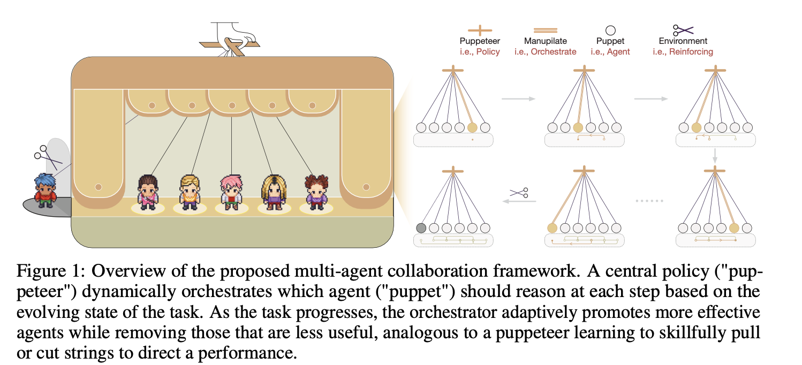

# Multi-Agent Collaboration via Evolving Orchestration
**Puppeteer** introduces a new way for large language models (LLMs) to collaborate efficiently on complex tasks.

Instead of static structures, our framework uses a centralized orchestrator (“puppeteer”) that dynamically directs multiple agents (“puppets”) based on evolving task states. The orchestrator is trained with reinforcement learning to sequence and prioritize agents, enabling flexible and adaptive collective reasoning.



# Hướng dẫn cài đặt và chạy

Hướng dẫn vận hành hiện tại đã được tách thành hai phần: thiết lập toàn bộ hệ thống và chạy từng mode/dataset. Xem [HUONG_DAN_CHAY.md](HUONG_DAN_CHAY.md).

Tài liệu deployment chuyên sâu cho Nemotron Q5 trên Modal vẫn nằm tại [deploy/reward_model/README.md](deploy/reward_model/README.md).

# Customization 

Puppeteer provides multiple ways to tailor the system to your needs

## Agents
### 🔎 Agent Categories

In this framework, agents are divided into two main categories based on whether they have access to external tools:

1. Agents with Tools
    - Description: These agents can interact with external systems to gather data, execute code, or access files.
    - Supported Actions: `TOOL_ACTION_LIST`
        - search_arxiv – Search for academic papers on arXiv
        - search_bing – Query the Bing search engine
        - access_website – Access websites and extract information
        - run_python – Execute Python code
        - read_file – Read and extract content from files

2. Agents without Tools
    - Description: These agents focus on internal reasoning, critique, reflection, and summarization. They do not interact with external systems.
    - Supported Actions: `REASONING_ACTION_LIST`
        - reasoning – Logical reasoning
        - critique – Evaluate and critique reasoning
        - question – Generate clarifying sub-questions
        - reflect – Provide reflective analysis
        - conclude – Generate final conclusions
        - summarize – Summarize information concisely
        - planning – Create structured plans
        - modify – Correct errors and refine results

3. Termination Agent
    - Description: A special agent responsible for determining when the reasoning process should stop.
    - Supported Actions: `TERMINATION_ACTION_LIST`
        - terminate – End the reasoning process and deliver the final output

### ⚙️ Customize  

You can extend this framework by creating new agents, adding actions, or integrating new base models.  

#### 1. Multiple Actions per Agent  
- Currently, each agent is designed to perform **a single action** (see [`reasoning_agent.py`](puppeteer/agent/reasoning_agent.py)).  
- To create an agent that supports **multiple actions**, implement your own custom agent by inheriting from [`agent.py`](puppeteer/agent/agent.py).  

#### 2. Adding New Actions  
- To introduce a **new action**, you need to:  
  1. Define the corresponding **prompt or tool**.  
  2. Modify [`reasoning_agent.py`](puppeteer/agent/reasoning_agent.py) to integrate the new action into the reasoning workflow.  

#### 3. Supporting New Base Models  
- If you want to use a **new base model** for agents:  
  - Extend the configuration in [`model_config.py`](puppeteer/model/model_config.py).  
  - Ensure that the new model is properly registered and compatible with the agent framework.  

## 🎭 Puppeteer Training  

The training parameters are defined in [`policy.json`](puppeteer/config/policy.json). Key parameters include:  
### 🔹 Optimization  
- `learning_rate`: `0.0001`  
  Controls the learning speed of the policy network.  
- `sample_size`: `1`  
  Number of samples used per training step.  

### 🔹 Agent Scale Control  
- `max_num_agents`: `3`  
  Maximum number of agents allowed in the system.  
- `next_num_agents`: `3`  
  Number of agents spawned in the next step.  
- `max_path`: `6`  
  Maximum trajectory length for agent exploration.  

### 🔹 Reward Configuration  
- `gamma`: `0.99`  
  Discount factor for future rewards.  
- `reward_factors`: Shaping factors for different actions:  
  - `default`: `-1.0` → Penalty for invalid/neutral actions.  
  - `terminator`: `0.5` → Reward for correct termination.  
  - `web_search`: `-1.5` → Penalty for costly web-search actions.  

### 🔹 Cost Control  
- `scale`: `0.1`  
  Base cost scaling factor.  
- `growth_rate`: `1.0`  
  Linear growth rate of cost per step.  
- `inverse`: `false`  
  If set to `true`, applies inverse cost scaling.  

### 🔹 Training Paradigm  
The current training paradigm uses the hidden state of the last token from the Reward Model. This hidden state is passed through an MLP-based policy network to generate action probabilities.  
You can switch the Reward Model or design a new training paradigm by modifying the policy network input/output structure.  


# Citation
If you use Puppeteer in your work, please cite our NeurIPS 2025 paper:
```bibtex
@inproceedings{dang2025multiagentcollaboration,
  title={Multi-Agent Collaboration via Evolving Orchestration},
  author={Yufan Dang and Chen Qian and Xueheng Luo and Jingru Fan and Zihao Xie and Ruijie Shi and Weize Chen and Cheng Yang and Xiaoyin Che and Ye Tian and Xuantang Xiong and Lei Han and Zhiyuan Liu and Maosong Sun},
  booktitle={The Thirty-ninth Annual Conference on Neural Information Processing Systems (NeurIPS)},
  year={2025},
  url={https://arxiv.org/abs/2505.19591}
}
```
