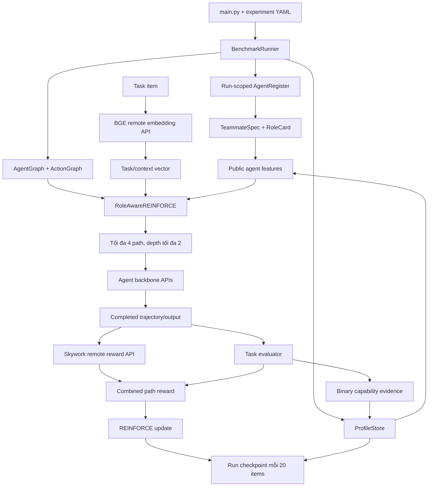

# Tài liệu codebase và hướng dẫn train hệ thống Role-Aware Puppeteer

> Phạm vi: code trong thư mục `puppeteer/`, trạng thái ngày 21/08/2026.
> Mục tiêu: giải thích kiến trúc hiện tại và cung cấp quy trình train có thể lặp lại, trong đó BGE Task Analyzer và Skywork Reward Model được serve trên GPU remote, còn orchestration và policy training chạy trên máy local.

---

# Phần 1 — Giải thích codebase

## 1. Tổng quan

Codebase triển khai một hệ thống multi-agent có orchestrator học cách chọn teammate theo task, role và capability profile.

Ba nhóm model có chức năng khác nhau:

1. **Backbone của agent**
   - Sinh reasoning, code hoặc câu trả lời.
   - Hiện pool S0 dùng API Hugging Face Router.
   - Model identity chỉ tồn tại trong `TeammateSpec` nội bộ; router không nhận model identity làm feature.

2. **Task Analyzer — BAAI/bge-large-en-v1.5**
   - Chuyển task/context thành vector 1024 chiều.
   - Là đầu vào trạng thái của policy network.
   - Chạy qua OpenAI-compatible embedding API.
   - Không tạo reward và không được train cùng policy.

3. **Trajectory Reward Model — Skywork 8B**
   - Chấm chất lượng của một path sau khi path đã kết thúc.
   - Nhận task, trajectory và final candidate output.
   - Không được gọi trước khi agent hành động và không được dùng làm router state.
   - Raw logit được server biến đổi bằng sigmoid thành `[0, 1]`.

Policy mới là `RoleAwareREINFORCE`. Baseline `ContinuousREINFORCE` vẫn nằm riêng trong `inference/policy/REINFORCE_continuous.py`.

## 2. Luồng thực thi tổng thể



## 3. Entry point và cấu hình

### 3.1. `main.py`

`main.py` chịu trách nhiệm:

- đọc experiment YAML;
- nhận override từ CLI;
- khóa mode hợp lệ;
- yêu cầu checkpoint explicit cho `evolved`;
- chọn task module;
- tạo `BenchmarkRunner`;
- dispatch profile build hoặc dataset run;
- ghi `resolved_config.yaml` cho từng run.

Các policy mode:

| Policy mode | Ý nghĩa | Có optimizer update? | Checkpoint |
|---|---|---:|---|
| `initialized` | Router mới khởi tạo, dùng để probe/smoke/profile comparison | Không | Không cần |
| `train` | Online REINFORCE trên train split | Có | Fresh train không cần; resume bắt buộc |
| `evolved` | Load router/profile đã train để evaluation | Không | Bắt buộc explicit |

Các dataset mode chính:

- `train`: chỉ update policy/profile khi `policy_mode=train`;
- `probe`, `dev`, `reference`, `final`: không update optimizer;
- `final`: bắt buộc `policy_mode=evolved`.

### 3.2. Cấu hình hai tầng

- `config/global.yaml`: API providers, graph topology, Task Analyzer, trajectory reward, logging và cost.
- `config/experiments/role_aware_*.yaml`: dataset, pool, tool policy, profile initialization, checkpoint và policy hyperparameters cho từng run.

Experiment YAML được deep-merge lên global config. Mỗi run ghi cấu hình cuối cùng vào:

```text
runs/<run_id>/resolved_config.yaml
```

Code không ghi đè `config/policy.json`.


### 3.3. Bản đồ thư mục

| Thư mục/file | Trách nhiệm chính |
|---|---|
| `main.py` | CLI, merge config, mode validation và dispatch task/profile build |
| `agent/` | Agent runtime, activation, prompt, reasoning/tool execution và run-scoped registry |
| `inference/graph/` | Agent graph, action graph, availability mask và public router view |
| `inference/reasoning/` | Vòng đời path, split/finalize path, answer aggregation và task transition |
| `inference/policy/` | Baseline policy và `RoleAwareREINFORCE` |
| `role_aware/` | Schema, Task Analyzer client, reward client, profile/evidence và checkpoint |
| `model/` | Model registry, provider profile và OpenAI-compatible query manager |
| `tasks/` | Loader, formatter, evaluator và vòng lặp của bốn benchmark |
| `tools/` | `run_python`, web/file tools và tool registry |
| `personas/role_aware/` | Các pool S0/S1/S2/S3 theo schema mới |
| `config/experiments/` | Per-run YAML và scenario matrix |
| `prompts/general/` | System/action/aggregation prompts |
| `scripts/` | Tạo split/pool, kiểm tra provider và serve Skywork |
| `tests/` | Foundation, pipeline, task analyzer, reward và run lifecycle tests |
| `data/` | Dataset source và split manifests đã khóa |
| `runs/`, `logs/` | Kết quả/checkpoint theo run và workspace/log theo item |


## 4. Persona schema và agent pool

### 4.1. Ba schema chính

Các schema nằm trong `role_aware/schemas.py`.

**RoleCard** mô tả chức năng công khai của role:

- `role_name`, `role_goal`;
- `core_functions`;
- `allowed_actions`, `forbidden_actions`;
- input/output schema;
- tools;
- capability prior.

**TeammateSpec** chứa thông tin nội bộ:

- `teammate_id`;
- `backbone`;
- `provider_profile`;
- `RoleCard`;
- decoding config;
- availability và metadata.

**CapabilityProfile** lưu trạng thái online:

- mean, uncertainty và observation count cho 10 capability dimensions;
- role adherence;
- global reliability;
- update step.

Mười capability dimensions:

1. planning;
2. general reasoning;
3. quantitative reasoning;
4. domain reasoning;
5. software engineering;
6. commonsense generation;
7. verification;
8. repair;
9. integration;
10. tool use.

### 4.2. Pool S0

`personas/role_aware/s0_pool.jsonl` có 22 teammate:

- 11 role;
- 2 teammate cho mỗi role;
- backbone distribution:
  - 6 × `qwen-2.5-7b`;
  - 6 × `llama-3.2-3b`;
  - 5 × `qwen-2.5-14b`;
  - 5 × `llama-3.1-8b`.

Bốn API model hiện được pin trong `model/model_config.py`:

| Internal key | API model |
|---|---|
| `qwen-2.5-7b` | `Qwen/Qwen2.5-7B-Instruct:featherless-ai` |
| `llama-3.2-3b` | `meta-llama/Llama-3.2-3B-Instruct:featherless-ai` |
| `qwen-2.5-14b` | `Qwen/Qwen2.5-14B-Instruct:featherless-ai` |
| `llama-3.1-8b` | `meta-llama/Llama-3.1-8B-Instruct:novita` |

Tất cả dùng provider profile `huggingface_router` và biến môi trường `HF_TOKEN`.

### 4.3. Router không nhìn thấy model identity

`AgentGraph.public_agent_views()` chỉ đưa cho router:

- role;
- chức năng và action công khai;
- tool availability;
- capability mean/uncertainty/count;
- role adherence;
- global reliability.

Backbone, provider và teammate ID không được đưa trực tiếp vào feature router. Agent runtime vẫn giữ các trường này để gọi đúng API sau khi được chọn.

## 5. Registry và graph lifecycle

`BenchmarkRunner` tạo một `AgentRegister` mới cho mỗi run.

Registry:

- chỉ load pool một lần;
- từ chối load lần hai;
- reset episode state giữa các item;
- kiểm tra số agent không tăng sau mỗi item.

Hai graph:

- `AgentGraph`: tập agent và availability mask;
- `ActionGraph`: reasoning/tool/termination actions của episode hiện tại.

Tool availability phụ thuộc cả RoleCard và `tools.allowed` trong experiment YAML.

- GSM-Hard và SRDD cho phép `run_python`;
- MMLU-Pro và CW là closed-book;
- Python Tool Agent bị mask ở task không cho `run_python`.

## 6. Role-aware policy

### 6.1. State

`TaskAnalyzerRepresentation` gọi:

```text
POST <TASK_ANALYZER_BASE_URL>/embeddings
```

Request có model `BAAI/bge-large-en-v1.5`, `dimensions=1024` và `encoding_format=float`. Kết quả là tensor `[1, 1024]`.

### 6.2. Candidate features và network

Mỗi candidate có:

- one-hot role;
- capability means;
- uncertainties;
- normalized observation counts;
- role adherence;
- global reliability;
- availability-related features.

Policy dùng state encoder, agent encoder, multi-head set attention và shared scorer. Shared scorer cho phép thay đổi số lượng agent giữa các pool.

### 6.3. Action selection

- Lần đầu chưa cho phép STOP.
- Các bước sau có `__orchestrator_stop__`.
- Train dùng sampling; evaluation dùng argmax.
- Threshold được tính động bằng `1 / số agent đang khả dụng`; candidate đạt hoặc vượt ngưỡng có thể tạo parallel paths.
- `max_width` chỉ là số path tối đa, không phải threshold và không bảo đảm luôn tạo đủ số path.
- `max_width=3`, `max_depth=4` — cấu hình W3D4 đã khóa.

### 6.4. Giới hạn context cho backbone LLM

Agent giữ toàn bộ `dialog_history` trong bộ nhớ. Trước mỗi API call, runtime tạo một bản sao request deterministic, luôn giữ system prompt và các message mới nhất rồi giới hạn theo `chat_context` trong `config/global.yaml`. Bản gốc không bị mutate.

Budget mặc định là 24.000 input token ước lượng. Ba lần gọi dùng lần lượt 24.000, 18.000 và 13.500 token; output dành tối đa 4.096 token. Log `[Model Query Context]` ghi số message/token ước lượng bị cắt nhưng không log probability.

## 7. Reward và thời điểm Skywork được gọi

Mỗi lần chọn teammate nhận `-step_penalty`; chọn STOP không nhận step penalty.

Khi một path kết thúc:

1. evaluator tạo task reward;
2. serializer tạo `task + trajectory + candidate_output`;
3. Skywork được gọi đúng một lần cho path đó;
4. token cost được trừ;
5. terminal reward được cộng vào transition cuối.

Với cấu hình hiện tại:

```text
skywork_centered = 2 × sigmoid(raw_logit) - 1
skywork_weighted = 0.1 × skywork_centered

terminal_reward =
    task_reward
    + skywork_weighted
    - token_cost_weight × normalized_token_cost
```

Skywork chỉ active khi đồng thời có:

- `trajectory_reward.enabled=true`;
- `dataset_mode=train`;
- `policy_mode=train`;
- optimizer training đang bật.

Skywork không được gọi trong probe profile build, dev hoặc final. Với W3D4, một item có thể tạo tối đa 3 completed paths, tức tối đa khoảng 3 request Skywork. Model không được gọi sau từng action.

Serializer loại bỏ gold answer, model identity, provider profile, teammate ID và token/cost metadata. Nếu Skywork lỗi và `failure_policy=task_reward_only`, train vẫn tiếp tục bằng task reward; cần theo dõi `skywork_status` trong reward trace.

## 8. Capability profile

### 8.1. Probe profile trước fresh train

Fresh train yêu cầu probe profile hoàn chỉnh. Profile build dùng `FixedTeammatePolicy`:

- mỗi available teammate chạy toàn bộ 10 probe items;
- không học router;
- không gọi Skywork;
- thu binary evidence từ kết quả task.

| Task | Available teammates | Probe items/teammate | Tổng trajectory |
|---|---:|---:|---:|
| GSM-Hard | 22 | 10 | 220 |
| MMLU-Pro | 20 | 10 | 200 |
| SRDD | 22 | 10 | 220 |
| CW | 20 | 10 | 200 |

MMLU-Pro và CW có 20 available teammates vì Python Tool Agent bị mask.

Mỗi profile có:

```text
<profile>.json
<profile>.manifest.json
<profile>.assignment.json
```

Manifest chỉ có `complete=true` sau khi toàn bộ available teammates hoàn tất. Fresh train kiểm tra task, seed, split hash, pool fingerprint, item count và teammate set.

### 8.2. Online update

Sau khi path kết thúc:

- chỉ teammate xuất hiện trong path được update;
- successful path tạo observation 1;
- failed path tạo observation 0;
- unselected teammate không đổi;
- global reliability luôn được update;
- capability update trên giao của role scope và task scope;
- parallel evidence được gom theo task rồi update theo batch.

Profile dùng EMA với `alpha=0.2`.

### 8.3. Evaluation

Trong `probe/dev/final`:

- optimizer không update;
- capability profile không update;
- evolved với `--profile_source checkpoint` load policy và profile từ checkpoint;
- evolved với `--profile_source probe/reference/priors` chỉ load policy từ
  checkpoint rồi dùng profile tương ứng với pool hiện tại;
- dataset progress train không làm evaluation bỏ qua item.

## 9. Checkpoint và resume

Run checkpoint chứa:

- policy network;
- optimizer;
- capability profiles;
- `global_step`;
- Python/NumPy/Torch CPU/Torch CUDA RNG;
- dataset progress;
- metadata hash của config, split và pool.

Đường dẫn:

```text
runs/<run_id>/checkpoints/checkpoint_initial.pt
runs/<run_id>/checkpoints/latest.pt
runs/<run_id>/checkpoints/checkpoint_item_XXXX.pt
```

Quy tắc:

- fresh train tự động lưu `checkpoint_initial.pt` sau khi nạp probe profile và đăng ký cửa sổ dữ liệu, trước item đầu tiên;
- `checkpoint_initial.pt` là bất biến, không bị `latest.pt` hoặc snapshot ghi đè;
- `latest.pt` và snapshot mỗi 20 completed items;
- giữ 3 snapshot mới nhất;
- cuối run bình thường force-save `latest.pt`;
- resume phải truyền `--checkpoint` explicit;
- `data_start`/`data_limit` khi resume phải giống run gốc.
- resume train luôn dùng exact restore: policy, optimizer, profile, RNG và progress;
- evolved dùng profile checkpoint cũng exact restore theo pool fingerprint;
- evolved dùng external profile là policy-transfer: cho phép pool fingerprint khác,
  nhưng vẫn kiểm tra task, seed, split, config và kiến trúc policy;
- policy-transfer không restore optimizer, RNG hoặc dataset progress.

Artifact JSONL được flush và fsync trước khi item được đánh dấu completed. Nếu JSONL đi trước checkpoint, phần dư được backup thành `*.uncommitted_after_XXXX.jsonl`, artifact được cắt về checkpoint boundary và item chưa commit được replay.

## 10. Dataset và evaluator

| Task | Source file | Train | Dev | Reference | Probe | Final |
|---|---|---:|---:|---:|---:|---:|
| GSM-Hard | `data/GSM-Hard/test.parquet` | 200 | 100 | 100 | 10 | 909 |
| MMLU-Pro | `data/MMLU-Pro/test.parquet` | 200 | 140 | 280 | 10 | 2000 |
| SRDD | `data/SRDD/SRDD.csv` | 200 | 100 | 100 | 10 | 790 |
| CW | `data/CW/creative_writing.jsonl` | 80 | 20 | 40 | 10 | 50 |

Split được khóa trong `data/splits/*_seed42.json`.

Evaluator:

- GSM-Hard: numerical correctness;
- MMLU-Pro: multiple-choice correctness;
- SRDD: executability, completeness, semantic consistency;
- CW: concept coverage và Gemini judge cho grammar/relevance/consistency.

Binary success:

- SRDD: executable, complete và consistency ≥ 0.70;
- CW: coverage đầy đủ và ba judge score ≥ 0.75.

## 11. Artifact và logging

```text
runs/<run_id>/
├── resolved_config.yaml
├── results/
└── checkpoints/
    ├── checkpoint_initial.pt
    ├── latest.pt
    └── checkpoint_item_XXXX.pt
```

Mỗi reasoning item còn tạo workspace trong `logs/<task>/<timestamp>/`, có thể chứa `meta.log`, `model_query.log`, `train.log`, `pathN.log`, generated artifact, graph HTML và `trajectory_rewards.jsonl`.

## 12. Điểm cần biết trước full train

### 12.1. Production Role-Aware đã kế thừa BGE từ global config

`config/global.yaml` đã pin `task_analyzer.primary` thành BGE remote 1024 chiều. Các production YAML không override block này nên tự động kế thừa BGE qua cơ chế deep-merge; không cần lặp lại cấu hình trong từng file.

Block `state_representation` dùng Gemini là cấu hình legacy riêng của `ContinuousREINFORCE`, không phải state encoder của `RoleAwareREINFORCE`.

`role_aware_gsm_bge_remote_smoke.yaml` cũng dùng BGE nhưng đặt profile source là priors và tắt trajectory reward. Không dùng file smoke này cho full train.

### 12.2. SRDD còn dùng embedding evaluator legacy

`BenchmarkEvaluator.srdd_consistency()` gọi `OpenAIEmbedding`, hard-code `text-embedding-ada-002` và đọc legacy `api_keys`. Đây không phải Task Analyzer BGE. Cấu hình Gemini hiện tại không bảo đảm hỗ trợ tên model này.

Trước full SRDD phải:

1. cấu hình endpoint thực sự hỗ trợ `text-embedding-ada-002`; hoặc
2. sửa evaluator dùng embedding endpoint/model được pin, rồi khóa evaluator trước thí nghiệm.

Không bắt đầu full SRDD khi smoke evaluator chưa thành công.

### 12.3. Reference profile và evolved checkpoint

Nếu không truyền `--profile_source`, evolved mặc định dùng `checkpoint` để giữ
hành vi S0: policy và profile đều được lấy từ checkpoint, đồng thời pool phải khớp.

Để test pool mới, truyền explicit `--profile_source probe` hoặc `reference` cùng
`--profile_path`. Khi đó runner chỉ chuyển policy weights và `global_step` từ
checkpoint; profile được kiểm tra manifest rồi nạp cho pool hiện tại. Dùng
`--profile_source priors` nếu muốn ablation không dùng profile đã quan sát.

---

# Phần 2 — Hướng dẫn train

## 1. Kiến trúc triển khai đề xuất

### GPU remote

Khuyến nghị serve đồng thời BGE-large và Skywork 8B không quantize:

- 1 × RTX 5090 32 GB hoặc GPU 32 GB tương đương;
- tối thiểu 16 vCPU;
- RAM 64 GB;
- disk 150 GB NVMe;
- Ubuntu 22.04, template CUDA 12.4;
- public IP và SSH.

24 GB có thể chạy nhưng biên thấp hơn. Nếu buộc dùng 24 GB, có thể thử Skywork 8-bit. Không đổi quantization giữa các run khoa học.

RTX 3060 12 GB phù hợp serve riêng BGE, không phải cấu hình khuyến nghị cho BGE + Skywork BF16 cùng lúc.

### Máy local

Máy local chạy dataset/evaluator, orchestration, CPU policy network, checkpoint; gọi backbone qua Hugging Face Router và gọi BGE/Skywork qua SSH tunnel.

## 2. Giai đoạn A — GPU remote chưa có Python

### A1. Kiểm tra máy

Chọn **CUDA 12.4 Ubuntu 22.04**, SSH vào server:

```bash
nvidia-smi
cat /etc/os-release
```

Driver có thể hiển thị CUDA 13.x; Torch CUDA 12.4 vẫn chạy nếu driver tương thích ngược.

### A2. Cài Python

```bash
apt update
DEBIAN_FRONTEND=noninteractive apt install -y \
  python3 python3-venv python3-pip git curl nano

python3 --version
pip3 --version
```

### A3. Tạo virtual environment

```bash
python3 -m venv /opt/role-aware-serving
source /opt/role-aware-serving/bin/activate
python -m pip install --upgrade pip setuptools wheel
```

### A4. Cài Torch và dependency

```bash
python -m pip install torch==2.6.0 \
  --index-url https://download.pytorch.org/whl/cu124

python -m pip install \
  numpy sentence-transformers \
  "transformers>=4.45,<5" \
  accelerate safetensors sentencepiece \
  fastapi "uvicorn[standard]" pydantic requests
```

Nếu dùng quantization:

```bash
python -m pip install bitsandbytes
```

Kiểm tra:

```bash
python -c "import torch; print('torch:',torch.__version__); print('cuda:',torch.cuda.is_available()); print('gpu:',torch.cuda.get_device_name(0) if torch.cuda.is_available() else 'NONE'); print('vram_gb:',round(torch.cuda.get_device_properties(0).total_memory/1024**3,2) if torch.cuda.is_available() else 0)"
```

Kết quả bắt buộc có `cuda: True`.

```bash
mkdir -p /opt/hf-cache /opt/bge-model-cache /opt/puppeteer-serving
export HF_TOKEN="hf_..."
export HF_HOME=/opt/hf-cache
```

Không ghi token thật vào Git hoặc ảnh chụp.

## 3. Serve BGE Task Analyzer

### A5. Tạo server

```bash
nano /opt/bge_server.py
```

Dán nội dung:

```python
import os
import secrets
from threading import Lock
from typing import Union

import numpy as np
import torch
from fastapi import FastAPI, Header, HTTPException
from pydantic import BaseModel
from sentence_transformers import SentenceTransformer
from starlette.concurrency import run_in_threadpool


MODEL_NAME = os.getenv("BGE_MODEL", "BAAI/bge-large-en-v1.5")
API_KEY = os.getenv("BGE_API_KEY", "")
CACHE_DIR = os.getenv("BGE_CACHE_DIR", "/opt/bge-model-cache")
DEVICE = "cuda" if torch.cuda.is_available() else "cpu"
DIMENSION = 1024

if not API_KEY:
    raise RuntimeError("Set BGE_API_KEY before starting the server")

model = SentenceTransformer(
    MODEL_NAME,
    device=DEVICE,
    cache_folder=CACHE_DIR,
)
model_lock = Lock()
app = FastAPI(title="BGE OpenAI-compatible Embedding API")


class EmbeddingRequest(BaseModel):
    model: str = MODEL_NAME
    input: Union[str, list[str]]
    dimensions: int = DIMENSION
    encoding_format: str = "float"


def authorize(authorization: str | None) -> None:
    expected = f"Bearer {API_KEY}"
    if authorization is None or not secrets.compare_digest(authorization, expected):
        raise HTTPException(status_code=401, detail="Invalid API key")


def encode_texts(texts: list[str]):
    with model_lock:
        return model.encode(
            texts,
            normalize_embeddings=True,
            convert_to_numpy=True,
        )


@app.get("/health")
def health():
    return {
        "status": "ok",
        "model": MODEL_NAME,
        "device": DEVICE,
        "dimension": DIMENSION,
    }


@app.post("/v1/embeddings")
async def embeddings(
    request: EmbeddingRequest,
    authorization: str | None = Header(default=None),
):
    authorize(authorization)

    if request.model != MODEL_NAME:
        raise HTTPException(status_code=400, detail="Unsupported model")
    if request.dimensions != DIMENSION:
        raise HTTPException(status_code=400, detail="Only dimensions=1024 is supported")
    if request.encoding_format != "float":
        raise HTTPException(status_code=400, detail="Only encoding_format=float is supported")

    texts = [request.input] if isinstance(request.input, str) else request.input
    if not texts or not all(isinstance(text, str) for text in texts):
        raise HTTPException(status_code=400, detail="input must contain text")

    vectors = await run_in_threadpool(encode_texts, texts)
    token_count = sum(len(model.tokenizer.encode(text)) for text in texts)

    return {
        "object": "list",
        "data": [
            {
                "object": "embedding",
                "index": index,
                "embedding": vector.astype(np.float32).tolist(),
            }
            for index, vector in enumerate(vectors)
        ],
        "model": MODEL_NAME,
        "usage": {
            "prompt_tokens": token_count,
            "total_tokens": token_count,
        },
    }
```

Kiểm tra cú pháp:

```bash
source /opt/role-aware-serving/bin/activate
BGE_API_KEY=test-key python -m py_compile /opt/bge_server.py
```

### A6. Khởi động BGE

```bash
export BGE_API_KEY="replace-with-a-long-random-key"

nohup env \
  BGE_API_KEY="$BGE_API_KEY" \
  BGE_CACHE_DIR=/opt/bge-model-cache \
  HF_HOME=/opt/hf-cache \
  /opt/role-aware-serving/bin/python -m uvicorn \
  --app-dir /opt bge_server:app \
  --host 127.0.0.1 --port 8080 --workers 1 \
  > /var/log/bge-server.log 2>&1 &

echo $! > /var/run/bge-server.pid
tail -f /var/log/bge-server.log
```

Health:

```bash
curl -sS http://127.0.0.1:8080/health
```

Embedding smoke:

```bash
curl -sS http://127.0.0.1:8080/v1/embeddings \
  -H "Authorization: Bearer $BGE_API_KEY" \
  -H "Content-Type: application/json" \
  -d '{
    "model": "BAAI/bge-large-en-v1.5",
    "input": "Solve this math problem and return the final numerical answer.",
    "dimensions": 1024,
    "encoding_format": "float"
  }' \
| python3 -c "import sys,json,math; d=json.load(sys.stdin); v=d['data'][0]['embedding']; print('dimension:',len(v)); print('norm:',math.sqrt(sum(x*x for x in v)))"
```

Mong đợi dimension 1024, norm xấp xỉ 1.

## 4. Serve Skywork Reward Model

### A7. Copy code từ local

Trên PowerShell local, tại `D:\SideProject\ChatDev\puppeteer`:

```powershell
ssh root@<REMOTE_IP> -p <PORT> "mkdir -p /opt/puppeteer-serving/scripts"

scp -P <PORT> .\scripts\serve_skywork_reward.py root@<REMOTE_IP>:/opt/puppeteer-serving/scripts/

scp -r -P <PORT> .\role_aware root@<REMOTE_IP>:/opt/puppeteer-serving/
```

### A8. Khởi động Skywork BF16

Trên remote:

```bash
source /opt/role-aware-serving/bin/activate
cd /opt/puppeteer-serving

export SKYWORK_REWARD_API_KEY="replace-with-another-long-random-key"

nohup env \
  HF_TOKEN="$HF_TOKEN" \
  HF_HOME=/opt/hf-cache \
  SKYWORK_REWARD_API_KEY="$SKYWORK_REWARD_API_KEY" \
  SKYWORK_REWARD_MODEL="Skywork/Skywork-Reward-V2-Llama-3.1-8B" \
  SKYWORK_REWARD_TORCH_DTYPE=bf16 \
  SKYWORK_REWARD_DEVICE_MAP=auto \
  SKYWORK_REWARD_QUANTIZATION=none \
  SKYWORK_REWARD_HOST=127.0.0.1 \
  SKYWORK_REWARD_PORT=8081 \
  /opt/role-aware-serving/bin/python scripts/serve_skywork_reward.py \
  > /var/log/skywork-reward.log 2>&1 &

echo $! > /var/run/skywork-reward.pid
```

Nếu thiếu VRAM trên 24 GB, thử `SKYWORK_REWARD_QUANTIZATION=8bit`. Không đổi quantization giữa các run cùng bảng so sánh.

### A9. Warm-up

Health trước warm-up có thể có `"loaded": false` vì model load lazy.

```bash
curl -sS http://127.0.0.1:8081/health
```

Gọi reward:

```bash
curl -sS http://127.0.0.1:8081/v1/reward \
  -H "Authorization: Bearer $SKYWORK_REWARD_API_KEY" \
  -H "Content-Type: application/json" \
  -d '{
    "model": "Skywork/Skywork-Reward-V2-Llama-3.1-8B",
    "messages": [
      {"role": "user", "content": "Task: What is 2 + 2?"},
      {"role": "assistant", "content": "Trajectory: calculate. Final candidate output: 4"}
    ]
  }'
```

Response phải có score hữu hạn trong `[0,1]`.

```bash
curl -sS http://127.0.0.1:8081/health
nvidia-smi --query-compute-apps=pid,used_memory --format=csv
```

Health sau warm-up phải có `"loaded": true`.

## 5. SSH tunnel

Không mở port 8080/8081 ra Internet. Giữ server bind `127.0.0.1`.

Trên cửa sổ PowerShell local riêng:

```powershell
ssh -N -L 18080:127.0.0.1:8080 -L 18081:127.0.0.1:8081 root@<REMOTE_IP> -p <PORT>
```

Giữ cửa sổ mở khi train.

```powershell
Test-NetConnection 127.0.0.1 -Port 18080
Test-NetConnection 127.0.0.1 -Port 18081
```

Cả hai phải có `TcpTestSucceeded : True`.

## 6. Giai đoạn B — Chuẩn bị local

### B1. Environment sạch

```powershell
conda create -n puppeteer-role-aware python=3.10 -y
conda activate puppeteer-role-aware
python -m pip install --upgrade pip
```

Dependency chính:

```powershell
python -m pip install `
  pyyaml==6.0.3 `
  pandas==2.3.3 `
  pyarrow==22.0.0 `
  tqdm==4.67.1 `
  "numpy<2.3" `
  openai==2.15.0 `
  networkx==3.6.1 `
  pyvis==0.3.2 `
  seaborn `
  easydict==1.10 `
  tenacity requests sympy

python -m pip install torch==2.8.0 `
  --index-url https://download.pytorch.org/whl/cpu
```

Kiểm tra:

```powershell
python -c "import yaml,pandas,pyarrow,tqdm,numpy,torch,openai,networkx,pyvis,easydict,tenacity,requests,sympy,seaborn; print('dependencies: OK')"
python -m pip check
```

Environment riêng tránh conflict LangChain/OpenCV từ base environment.

### B2. Biến môi trường

Trong cùng PowerShell sẽ chạy train:

```powershell
$env:HF_TOKEN = "<HF_TOKEN>"

$env:TASK_ANALYZER_BASE_URL = "http://127.0.0.1:18080/v1"
$env:TASK_ANALYZER_API_KEY = "<BGE_API_KEY>"

$env:SKYWORK_REWARD_BASE_URL = "http://127.0.0.1:18081"
$env:SKYWORK_REWARD_API_KEY = "<SKYWORK_REWARD_API_KEY>"

$env:GEMINI_API_KEY = "<GEMINI_API_KEY>"
```

`GEMINI_API_KEY` cần cho CW judge. SRDD cần xử lý evaluator legacy như Phần 1.

Kiểm tra không in secret:

```powershell
foreach ($name in @(
    "HF_TOKEN",
    "TASK_ANALYZER_BASE_URL",
    "TASK_ANALYZER_API_KEY",
    "SKYWORK_REWARD_BASE_URL",
    "SKYWORK_REWARD_API_KEY",
    "GEMINI_API_KEY"
)) {
    $value = [Environment]::GetEnvironmentVariable($name, "Process")
    if ([string]::IsNullOrWhiteSpace($value)) {
        "$name : MISSING"
    } else {
        "$name : SET"
    }
}
```

### B3. Xác nhận production kế thừa BGE

Không dùng `role_aware_gsm_bge_remote_smoke.yaml` cho full train.

Không cần thêm `task_analyzer` vào từng production YAML. Cấu hình active đã nằm trong `config/global.yaml`:

```yaml
task_analyzer:
  primary:
    backend: openai_compatible_embedding
    model: BAAI/bge-large-en-v1.5
    dim: 1024
    frozen: true
    base_url_env: TASK_ANALYZER_BASE_URL
    api_key_env: TASK_ANALYZER_API_KEY
    max_input_tokens: 512
```

Production train đồng thời kế thừa Skywork đang bật trong `config/global.yaml`. Không thêm override `trajectory_reward.enabled: false`.

Kiểm tra `runs/<run_id>/resolved_config.yaml` sau khi chạy:

```yaml
task_analyzer:
  primary:
    model: BAAI/bge-large-en-v1.5
    dim: 1024

trajectory_reward:
  enabled: true
  backend: http
  model: Skywork/Skywork-Reward-V2-Llama-3.1-8B
```

## 7. Dataset và split

```powershell
Set-Location D:\SideProject\ChatDev\puppeteer
```

Kiểm tra source:

```powershell
@(
  "data/GSM-Hard/test.parquet",
  "data/MMLU-Pro/test.parquet",
  "data/SRDD/SRDD.csv",
  "data/CW/creative_writing.jsonl"
) | ForEach-Object {
  "$_ : $(Test-Path $_)"
}
```

Kiểm tra manifest:

```powershell
Get-ChildItem data/splits/*_seed42.json
```

Nếu chưa có và source đúng phiên bản:

```powershell
python -m scripts.build_dataset_splits
```

Không tạo lại split giữa các run khoa học. Giữ seed 42 và lưu hash manifest.

## 8. Smoke test service/provider

### B4. BGE từ local

```powershell
$headers = @{
    Authorization = "Bearer $env:TASK_ANALYZER_API_KEY"
}

$body = @{
    model           = "BAAI/bge-large-en-v1.5"
    input           = "Solve this math problem and return the final numerical answer."
    dimensions      = 1024
    encoding_format = "float"
} | ConvertTo-Json

$response = Invoke-RestMethod `
    -Uri "$env:TASK_ANALYZER_BASE_URL/embeddings" `
    -Method Post `
    -Headers $headers `
    -ContentType "application/json" `
    -Body $body

$vector = $response.data[0].embedding
$norm = [Math]::Sqrt(
    ($vector | ForEach-Object { $_ * $_ } | Measure-Object -Sum).Sum
)

"dimension: $($vector.Count)"
"norm: $norm"
```

Bắt buộc dimension 1024 và norm xấp xỉ 1.

### B5. Skywork từ local

```powershell
$headers = @{
    Authorization = "Bearer $env:SKYWORK_REWARD_API_KEY"
}

$body = @{
    model = "Skywork/Skywork-Reward-V2-Llama-3.1-8B"
    messages = @(
        @{ role = "user"; content = "Task: What is 2 + 2?" },
        @{ role = "assistant"; content = "Trajectory: calculate. Final candidate output: 4" }
    )
} | ConvertTo-Json -Depth 5

Invoke-RestMethod `
    -Uri "$env:SKYWORK_REWARD_BASE_URL/v1/reward" `
    -Method Post `
    -Headers $headers `
    -ContentType "application/json" `
    -Body $body
```

Score phải trong `[0,1]`.

### B6. Bốn backbone

```powershell
python scripts/check_api_profiles.py --profiles huggingface_router
```

```powershell
@'
from model.query_manager import query_manager

models = [
    "qwen-2.5-7b",
    "llama-3.2-3b",
    "qwen-2.5-14b",
    "llama-3.1-8b",
]

for model in models:
    content, tokens = query_manager.query(
        model,
        [{"role": "user", "content": "Reply with exactly OK"}],
    )
    print(model, repr(content), tokens)
'@ | python -
```

Nếu provider trả 503 capacity, retry sau; không đổi model giữa chừng trong cùng experiment.

### B7. Unit tests

```powershell
python -m unittest discover -s tests -p "test_*.py" -q
```

Trạng thái hiện tại: 39 tests pass.

## 9. Tạo probe profiles

Fresh train không chạy nếu thiếu completed probe profile.

### GSM-Hard

```powershell
python main.py gsm-hard probe `
  --config config/experiments/role_aware_gsm.yaml `
  --build_probe_profiles
```

### MMLU-Pro

```powershell
python main.py MMLU-Pro probe `
  --config config/experiments/role_aware_mmlu_pro.yaml `
  --build_probe_profiles
```

### SRDD

Chỉ chạy sau khi evaluator embedding smoke thành công:

```powershell
python main.py SRDD probe `
  --config config/experiments/role_aware_srdd.yaml `
  --build_probe_profiles
```

### CW

Cần `GEMINI_API_KEY` cho judge:

```powershell
python main.py CW probe `
  --config config/experiments/role_aware_cw.yaml `
  --build_probe_profiles
```

Ví dụ artifact GSM:

```text
profiles/artifacts/gsm-hard_s0_seed42_probe_profiles.json
profiles/artifacts/gsm-hard_s0_seed42_probe_profiles.manifest.json
profiles/artifacts/gsm-hard_s0_seed42_probe_profiles.assignment.json
```

```powershell
Get-Content profiles/artifacts/gsm-hard_s0_seed42_probe_profiles.manifest.json
```

Chỉ tiếp tục khi `"complete": true`.

## 10. Fresh train

Train một task tại một thời điểm để dễ kiểm soát API cost, GPU reward server, checkpoint và logs.
Fresh train tự động lưu `checkpoint_initial.pt` trước item đầu tiên; không cần thêm cờ CLI.

### GSM-Hard

```powershell
python main.py gsm-hard train `
  --config config/experiments/role_aware_gsm.yaml `
  --policy_mode train
```

### MMLU-Pro

```powershell
python main.py MMLU-Pro train `
  --config config/experiments/role_aware_mmlu_pro.yaml `
  --policy_mode train
```

### SRDD

```powershell
python main.py SRDD train `
  --config config/experiments/role_aware_srdd.yaml `
  --policy_mode train
```

### CW

```powershell
python main.py CW train `
  --config config/experiments/role_aware_cw.yaml `
  --policy_mode train
```

Smoke một item sau khi đã có probe profile:

```powershell
python main.py gsm-hard train `
  --config config/experiments/role_aware_gsm.yaml `
  --policy_mode train `
  --data_limit 1 `
  --result_suffix train_smoke_1
```

Không dùng checkpoint smoke làm checkpoint chính.

## 11. Theo dõi train

### Local

```powershell
Get-ChildItem runs -Directory |
  Sort-Object LastWriteTime -Descending |
  Select-Object -First 5 Name, LastWriteTime
```

```powershell
Get-ChildItem runs/<RUN_ID>/checkpoints
```

```powershell
(Get-Content runs/<RUN_ID>/results/*.jsonl |
  Where-Object { -not [string]::IsNullOrWhiteSpace($_) }).Count
```

Reward traces:

```powershell
Get-ChildItem logs -Recurse -Filter trajectory_rewards.jsonl |
  Sort-Object LastWriteTime -Descending |
  Select-Object -First 5 FullName, LastWriteTime
```

Kiểm tra:

- `skywork_status` chủ yếu là `ok`;
- `skywork_raw` trong `[0,1]`;
- `scorer_model` đúng Skywork 8B;
- không có lỗi lặp lại.

### Remote

```bash
tail -f /var/log/bge-server.log
tail -f /var/log/skywork-reward.log
watch -n 2 nvidia-smi
```

Nếu Skywork lỗi nhưng local vẫn chạy, `failure_policy=task_reward_only` có thể đang làm train tiếp tục không có auxiliary reward.

## 12. Resume train

```powershell
python main.py gsm-hard train `
  --config config/experiments/role_aware_gsm.yaml `
  --policy_mode train `
  --checkpoint "runs\<RUN_ID>\checkpoints\latest.pt" `
  --data_start 0 `
  --data_limit 200 `
  --result_suffix train_200
```

Có thể resume từ policy chưa học bằng cách thay `latest.pt` bằng `checkpoint_initial.pt`; khi đó run bắt đầu lại từ item 0 với đúng probe profile, optimizer, RNG và data window đã lưu.

Không thay đổi seed, pool, split manifest, Task Analyzer, topology, feature schema, `data_start`, `data_limit` hoặc reward config. Metadata mismatch sẽ fail-fast.

## 13. Dev và final

Dev:

```powershell
python main.py gsm-hard dev `
  --config config/experiments/role_aware_gsm.yaml `
  --policy_mode evolved `
  --profile_source checkpoint `
  --checkpoint runs/<RUN_ID>/checkpoints/latest.pt
```

Dev không update optimizer/profile, không gọi Skywork và chạy dev split từ đầu.

Final:

```powershell
python main.py gsm-hard final `
  --config config/experiments/role_aware_gsm.yaml `
  --policy_mode evolved `
  --profile_source checkpoint `
  --checkpoint runs/<RUN_ID>/checkpoints/latest.pt
```

Không tune trên final.

### 13.1. Generalization sang pool mới

Với mỗi pool S1/S2/S3, tạo một probe profile riêng bằng đúng 10 item probe đã
khóa. Không dùng checkpoint khi build profile và không ghi đè artifact S0.

Ví dụ S1:

```powershell
python main.py gsm-hard probe `
  --config config/experiments/role_aware_gsm.yaml `
  --personas personas/role_aware/s1_pool.jsonl `
  --build_probe_profiles `
  --profile_path profiles/artifacts/gsm-hard_s1_seed42_probe_profiles.json
```

Sau khi manifest báo `complete=true`, chạy trained policy S0 với pool/profile S1:

```powershell
python main.py gsm-hard final `
  --config config/experiments/role_aware_gsm.yaml `
  --personas personas/role_aware/s1_pool.jsonl `
  --policy_mode evolved `
  --checkpoint "runs/<TRAIN_RUN_ID>/checkpoints/latest.pt" `
  --profile_source probe `
  --profile_path profiles/artifacts/gsm-hard_s1_seed42_probe_profiles.json `
  --result_suffix s1_trained_final
```

Lặp lại hai lệnh cho từng persona path trong
`config/experiments/scenario_matrix.yaml`, đồng thời đặt tên profile và
`result_suffix` riêng cho từng scenario.

Trong run generalization:

- chỉ policy weights và `global_step` được lấy từ checkpoint S0;
- profile phải có manifest khớp task, seed, split hash, pool fingerprint và toàn
  bộ teammate ID của pool mới;
- optimizer, RNG và dataset progress của train không được restore;
- final không update policy hoặc profile;
- `--profile_source checkpoint` vẫn yêu cầu đúng pool S0 và sẽ fail-fast nếu
  dùng nhầm với pool mới.

## 14. Reference profile comparison

Build reference profile:

```powershell
python main.py gsm-hard reference `
  --config config/experiments/role_aware_gsm.yaml `
  --build_reference_profiles
```

Default path:

```text
profiles/artifacts/gsm-hard_s0_seed42_reference_profiles.json
```

Để so sánh trained policy với reference profile, dùng policy-transfer:

```powershell
python main.py gsm-hard dev `
  --config config/experiments/role_aware_gsm.yaml `
  --policy_mode evolved `
  --checkpoint "runs/<TRAIN_RUN_ID>/checkpoints/latest.pt" `
  --profile_source reference `
  --profile_path profiles/artifacts/gsm-hard_s0_seed42_reference_profiles.json
```

Runner chỉ lấy policy từ checkpoint và lấy profile từ artifact reference explicit.
Nếu reference profile thuộc pool khác, phải truyền thêm `--personas` tương ứng.

## 15. Dừng remote service

```bash
kill "$(cat /var/run/bge-server.pid)"
kill "$(cat /var/run/skywork-reward.pid)"
nvidia-smi
```

Sau đó shutdown instance trên dashboard nhà cung cấp; dừng process không đồng nghĩa dừng tính phí.

## 16. Checklist trước full train

- [ ] GPU remote tối thiểu 24 GB, khuyến nghị 32 GB.
- [ ] BGE health OK, dimension 1024, norm xấp xỉ 1.
- [ ] Skywork health `loaded=true`, score trong `[0,1]`.
- [ ] SSH tunnel 18080/18081 hoạt động.
- [ ] `HF_TOKEN` gọi được cả bốn backbone.
- [ ] `config/global.yaml` dùng BGE remote và production YAML không override block này.
- [ ] Production YAML không tắt trajectory reward.
- [ ] Dataset và seed-42 manifests đúng.
- [ ] Probe profile manifest `complete=true`.
- [ ] Unit tests pass.
- [ ] SRDD evaluator embedding đã smoke riêng.
- [ ] CW Gemini judge đã smoke riêng.
- [ ] Chạy một-item smoke trước full train.
- [ ] Full train dùng run mới, không dùng smoke checkpoint.
- [ ] Theo dõi `skywork_status`.
- [ ] Resume luôn dùng explicit `latest.pt`.
